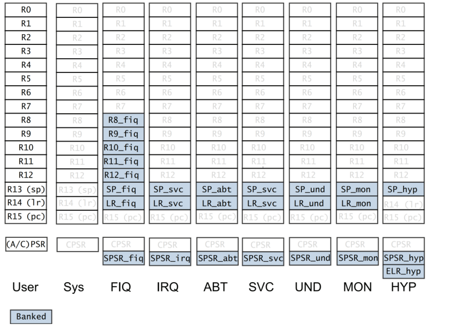
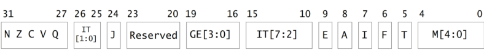
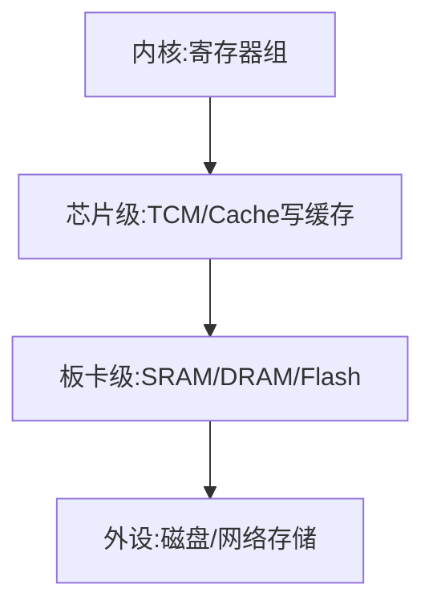
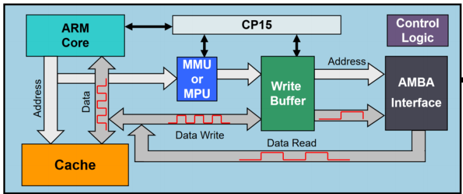

### Cortex-A 系列处理器介绍

#### ARM

ARM 一般有两个含义
ARM 公司，不生产，只进行 CPU 的框架设计
ARM 架构 Cortex-M、Cortex-A、Cortex-R

#### 裸机编程

没有操作系统运行之前的一段代码，可以是汇编也可以是 c 语言实现
bootloader 是一个裸机程序

#### ARM 内核发展

ARM 在 Cortex-A 系列处理器大体上按性能可以排序为：Cortex-A77 处理器、Cortex-A75 处理器、
Cortex-A73 处理器、 Cortex-A57 处理器、 Cortex-A53 处理器、 Cortex-A15 处理器、 Cortex-A9 处理器、 Cortex-A7 处理器、Cortex-A5 处理器等

ARM 产品指令集架构有 ARMv4、ARMv7、ARMv8，ARMv7 之后对 CPU 核心名称进行了调整，改用 Cortex-A,
Cortext-M 和 Cortex-R。
A 系列主要用于操作系统性能较好，M 系列通常用于单片机开发，R 系列主要用于实时控制方面
ARMv8 架构支持了 64bit 的指令集

#### 指令集 CPU 核心、CPU、SoC 区别

指令集通常是指 ARMv7 指令、ARMv8 指令集架构，这部分定义了整体的架构，例如定义了工作模式，中断的处理方法。

CPU 核心是指指令集的具体实现 Cortex-A7 就是根据 ARMv7 指令集来实现的 CPU 核心。

STM32MP157 是意法半导体根据 Cortex-A7 的 CPU 核心设计出来的一款 SoC，SoC 除了 CPU 之外还集成了很多控制器单元，例如 LCD 控制器单元和 UART 控制器单元等。

#### STM32MP157

##### 1.芯片资料

https://www.st.com/zh/microcontrollers-microprocessors/stm32mp157a.html#documentation

2 个 Cortex-A7 核心 MHZ 1 个 Cortex-M4 核心主频 209MHZ

通常需要下载数据手册、参考手册、编程手册、勘误手册

数据手册--介绍硬件特性，软件工程师一般查管脚

参考手册--数据手册的细化，介绍每个寄存器的使用，和软件开发关系密切

编程手册--讲述和芯片相关的体系结构的一些指令

勘误手册--介绍目前该芯片已知的问题，避坑

##### 2.ARM 资料

### Cortex-A7 开发环境

### Cortex-A7 结构

#### 内核工作模式

Cortex-A7 基于 ARMv7-A 架构，共有 9 种工作模式，除用户模式外的其他 8 种处理器模式称为特权模式（Privileged Modes）。在特权模式下，程序可以访问所有的系统资源，也可以任意地进行处理器模式切换

处理器模式可以通过软件控制进行切换，也可以通过外部中断或异常处理过程进行切换

##### 用户模式 usr

正常程序执行模式(非特权)，大部分任务执行在这种模式下

##### 快速中断模式 fiq

当一个高优先级（fast）中断产生时将会进入这种模式，一般用于高速数据传输和通道处理

##### 外部中断模式 irq

当一个低优先级（normal）中断产生时将会进入这种模式，一般用于通常的中断处理

##### 特权模式 svc

当复位或软中断指令执行时进入这种模式，是一种供操作系统使用的保护模式

##### 数据访问中止模式 abt

当存取异常时将会进入这种模式，用于虚拟存储或存储保护

##### 未定义指令中止模式 und

当执行未定义指令时进入这种模式，有时用于通过软件仿真协处理器硬件的工作方式

##### 系统模式 sys

使用和 User 模式相同寄存器集的模式，用于运行特权级操作系统任务

##### 监控模式 mon

可以在安全模式与非安全模式之间进行转换

##### 虚拟化监控模式 hyp

用于虚拟化扩展（可以在一个系统上运行多个操作系统），拥有 PL2 最高级别的权限，工作在正常非安全模式

#### 寄存器组织

Cortex-A7 处理器共有 9 种不同的处理器模式，在每一种处理器模式中都有一组相应的寄存器组



1、在寄存器组织的图中，每个小方块是一个寄存器，每个寄存器都是 32 位的。
2、寄存器没有地址，访问寄存器通过编号进行访问，r0-r15, cpsr, spsr。
3、banked 类型的寄存器属于私有的寄存器，而非 banked 类型的寄存器属于公有的寄存器。
4、user 模式和 system 模式最多可以访问 17 个寄存器， HYP 模式最多可以访问 19 个寄存器，其他的模式可以访问 18 个寄存器。
5、寄存器组织中只有 43 个寄存器，共计 172 字节，因此在开发中尽量不要定义 register 类型的变量，原因就是寄存器个数有限，寄存器类型的变量不可以进行取地址的操作，原因是寄存器没有地址。
6、当前处理器的模式决定着哪组寄存器可操作，任何模式都可以存取下列寄存器。

- 相应的 R0 ～ R12、相应的 R13（Stack Pointer，SP，栈指向）和 R14（the Link Register，LR，链路
  寄存器）。
- 相应的 R15（PC）、相应的 CPSR。特权模式（除 System 模式外）还可以存取相应的 SPSR。只有
  HYP 模式可以存取 ELR_hyp

7、通用寄存器根据其分组与否可分为以下两类：

- 未分组寄存器（Unbanked Register），包括 R0 ～ R7。对应 Low Registers。
- 分组寄存器（Banked Register），包括 R8 ～ R12。对应 High Register。

##### R13（栈指针）寄存器

对应 8 个不同的物理寄存器,一个是 User 模式和 Sys 模式和,而另外 7 个分别用于 7 种异常模式.

R13 寄存器在 ARM 处理器中常用做堆栈指针，称为 SP。这只是一种习惯用法，并没有任何指
令强制性的使用 R13 作为堆栈指针，用户完全可以使用其他寄存器作为堆栈指针。而在 Thumb 指令集
中，有一些指令强制性地将 R13 作为堆栈指针，如堆栈操作指令

在异常处理程序入口处，将用到的其他寄存器的值保存在堆栈中，返回时，重新将这些值加载
到寄存器。通过这种保护程序现场的方法，异常不会破坏被其中断的程序现场。

SP 栈指针寄存器中存放的是栈指针指向的栈空间的地址。此栈是用来压栈保存现场的，特点是先进
后出

##### R14（连接）寄存器

ARM 体系结构中具有下面两种特殊的作用

1.每一种处理器模式用自己的 R14 存放当前子程序的返回地址，当通过 BL 或 BLX 指令调用子程序时，R14 被设置成该子程序的返回地址。在子程序返回时，把 R14 的值复制到程序计数器（PC）

2.当异常中断发生时，该异常模式特定的物理寄存器 R14 被设置成该异常模式的返回地址，对于有些模式 R14 的值可能与返回地址有一个常数的偏移量（如数据异常使用 sub pc，lr，#8 返回）

##### R15（程序计数）寄存器

PC 寄存器中存储的是当前取指指令的地址，当完成取指操作之后，PC 中的值会自动加 4 指向下一条指令

#### 程序状态寄存器

##### CPSR 寄存器

CPSR 寄存器可以在任何处理器模式下被访问,包含内容：

- ALU（Arithmetic Logic Unit，算术逻辑单元）状态标志的备份
- 当前的处理器模式
- 中断使能标志
- 设置处理器的状态

每一种处理器模式下都有一个专用的物理寄存器做备份程序状态寄存器（Saved Program Status Register，SPSR），CPSR 寄存器（和保存它的 SPSR 寄存器）中的位分配如图所示



1.标志位
N（Negative）、Z（Zero）、C（Carry）和 V（oVerflow）通称为条件标志位，这些条件标志位会根据程序中的算术指令或逻辑指令的执行结果进行修改
N 标志位 ———— 设置成当前指令运行结果的 bit[31]的值 当两个由补码表示的有符号整数运算时，N=1 表示运算的结果为负数，N=0 表示结果为正数或零
Z 标志位 ———— Z=1 表示运算的结果为零 Z=0 表示运算的结果不为零。
C 标志位 ———— ① 加法指令中（包括 CMN）当结果产生了进位，则 C=1，表示无符号数运算发生上溢出；其他情况下 C=0 ② 在减法指令中（包括 CMP），当运算中发生错位（即无符号数运算发生下溢出），则 C=0；其他情况下 C=1 ③ 在操作数中包含移位操作的运算指令（非加/减法指令），C 被设置成被移位寄存器最后移出去的位 ④ 其他非加/减法运算指令，C 的值通常不受影响
V 标志位 ———— ① 加/减运算指令，当操作数和运算结果都是以二进制的补码表示的带符号的数时，且运算结果超出了有符号运算的范围是溢出。V=1 表示符号位溢出。② 非加/减法指令，通常不改变标志位 V 的值
Q 标志位 ———— 在带 DSP 指令扩展的 ARM v5 及更高版本中，bit[27]被指定用于指示增强的 DAP 指令是否发生了溢出，因此也就被称为 Q 标志位
J 标志位 ———— 在带 Java 指令支持的 ARM v5 及更高版本中支持。T=0；J=1 表示处于 Jazelle 状态

```txt
T   J   处理器状态
0   1   Jazelle 状态
0   0   ARM 状态
1   0   Thumb 状态
1   1   ThumbEE 状态
```

2.控制位
CPSR 的低 8 位（I、F、T 及 M[4:0]）统称为控制位,当异常发生时，这些位的值将发生相应的变化。另外，如果在特权模式下，也可以通过软件编程来修改这些位的值
中断禁止位 -- I=1，IRQ 被禁止;F=1，FIQ 被禁止;
状态控制位 -- T 位是处理器的状态控制位。T=0 ARM T=1 Thumb
模式控制位 -- M[4:0]作为位模式控制位，这些位的组合确定了处理器处于哪种状态。

```txt
M[4∶0]      处理器模式
0b10000    User 模式
0b10001    FIQ 模式
0b10010    IRQ 模式
0b10011    Supervisor 模式
0b10111    Abort 模式
0b11011    Undefined 模式
0b11111    System 模式
0b10110    Secure monitor 模式
0b11010    Hyp 模式
```

3.IF-THEN 标志位
CPSR 中的 bits[15:10,26:25]称为 if-then 标志位,用于对 thumb 指令集中 if-then-else 这一类语句块的控制

4.E 控制位
大小端控制位：E=1 设置为大端模式，E=0 为小端模式。

5.A 位
A=1 禁止不精确的数据异常

##### SPSR 寄存器

spsr：保存程序状态寄存器 ----> Saved Program Statued Register

> 注意：中断过程中，是由处理器自动将 cpsr 保持到 spsr_irq 的。

### Cortex-A7 内核存储系统和流水线

#### 存储系统

ARM 的存储器系统是由多级构成的，可以分为内核级、芯片级、板卡级、外设级



内核级 -- 典型的 ARM 处理器有多个 32 位寄存器，其访问时间为 ns 量级
芯片级 -- TCM 是一种快速 SDRAM，它紧挨内核，并且保证取指和数据操作的时钟周期数.芯片级的片上 Cache 存储器的容量在 8KB ～ 32KB 之间，访问时间大约为 10ns 级别
板卡级 -- 板卡级的 DRAM。主存储器可能是几 MB 到几十 MB 的动态存储器，访问时间大约为 100ns
外设级 -- 外设级的后援存储器，通常是硬盘，可能从几百 MB 到几十个 GB，访问时间约为几十 ms 级别

处理器核内部的存储管理单元主要包含有：Cache、MMU、Write Buffer（写缓存）等部分，以及可以控制相关存储单元的协处理 CP15


#### 存储管理单元 MMU

在创建多任务嵌入式系统时，最好用一个简单的方式来编写、装载及运行各自独立的任务。目前大多数的嵌入式系统不再使用自己定制的控制系统，而使用操作系统来简化这个过程。较高级的操作系统采用基于硬件的存储管理单元（MMU）来实现上述操作

MMU 提供的一个关键服务是使各个任务作为各自独立的程序在自己的私有存储空间中运行。在带 MMU 的操作系统控制下，运行的任务无须知道其他与之无关的任务的存储需求情况，这就简化了各个任务的设计

MMU 提供了一些资源以允许使用虚拟存储器（将系统物理存储器重新编址，可将其看成一个独立于系统物理存储器的存储空间）。MMU 作为转换器，将程序和数据的虚拟地址（编译时的连接地址）转换成实际的物理地址，即在物理主存中的地址。这个转换过程允许运行的多个程序使用相同的虚拟地址，而各自存储在物理存储器的不同位置;这样存储器就有两种类型的地址：虚拟地址和物理地址。虚拟地址由编译器和连接器在定位程序时分配；物理地址用来访问实际的主存硬件模块

#### 高速缓冲存储器（Cache）、写缓存器（write buffer）

Cache 是一个容量小但存取速度非常快的存储器，它保存最近用到的存储器数据副本。对于程序员来说，Cache 是透明的。

Cache 经常与写缓存器（write buffer）一起使用。写缓存器是一个非常小的先进先出（FIFO）存储器，位于处理器核与主存之间。使用写缓存的目的是，将处理器核和 Cache 从较慢的主存写操作中解脱出来。当 CPU 向主存储器做写入操作时，它先将数据写入到写缓存区中，由于写缓存器的速度很高，这种写入操作的速度也将很高。写缓存区在 CPU 空闲时，以较低的速度将数据写入到主存储器中相应的位置。

#### 流水线的概念与原理

处理器按照一系列步骤来执行每一条指令，典型的步骤如下
1、从存储器读取指令（fetch）
2、译码以鉴别它属于哪一条指令（decode）
3、从指令中提取指令的操作数（这些操作数往往存在于寄存器 reg 中）
4、将操作数进行组合以得到结果或存储器地址（ALU）
5、如果需要，则访问存储器以存储数据（mem）
6、将结果写回到寄存器堆（res）

有一种方法可以明显改善硬件资源的使用率和处理器的吞吐量，这就是在当前一条指令结束之前就开始执行下一条指令，即通常所说的流水线（Pipeline）技术。流水线是 RISC 处理器执行指令时采用的机制。使用流水线，可在取下一条指令的同时译码和执行其他指令，从而加快执行的速度。可以把流水线看做是汽车生产线，每个阶段只完成专门的处理器任务

#### 流水线的分类

##### 3 级流水线

到 ARM7 为止的 ARM 处理器使用简单的 3 级流水线，它包括下列流水线级
1、取指令（fetch）：从寄存器装载一条指令。
2、译码（decode）：识别被执行的指令，并为下一个周期准备数据通路的控制信号。在这一级，指令
占有译码逻辑，不占用数据通路。
3、执行（excute）：处理指令并将结果写回寄存器

##### 5 级流水线

较高性能的 ARM 核使用了 5 级流水线，而且具有分开的指令和数据存储器。把指令的执行分割为 5 部分而不是 3 部分，进而可以使用更高的时钟频率，分开的指令和数据存储器使核的 CPI 明显减少
在 ARM9TDMI 中使用了典型的 5 级流水线，5 级流水线包括下面的流水线级。
1、取指令（fetch）：从存储器中取出指令，并将其放入指令流水线。
2、译码（decode）：指令被译码，从寄存器堆中读取寄存器操作数。在寄存器堆中有 3 个操作数读端口，因此，大多数 ARM 指令能在 1 个周期内读取其操作数。
3、执行（execute）：将其中 1 个操作数移位，并在 ALU 中产生结果。如果指令是 Load 或 Store 指令，则在 ALU 中计算存储器的地址。
4、缓冲/数据（buffer/data）：如果需要则访问数据存储器，否则 ALU 只是简单地缓冲 1 个时钟周期。
5、回写（write-back）：将指令的结果回写到寄存器堆，包括任何从寄存器读出的数据。

##### 8 级流水线

在 Cortex-A7 中有一条 8 级的流水线，从经典 ARM 系列到现在的 Cortex 系列，ARM 处理器的结构在向复杂的阶段发展，但没改变的是 CPU 的取指指令和地址关系，不管是几级流水线，都可以按照最初的 3 级流水线的操作特性来判断其当前的 PC 位置。这样做主要还是为了软件兼容性上的考虑，由此可以判断的是，后面 ARM 所推出的处理核心都满足这一特点

#### 影响流水线性能的因素

- 互锁
  在典型的程序处理过程中，经常会遇到这样的情形，即一条指令的结果被用做下一条指令的操作数，流水线的操作产生中断
- 跳转指令
  跳转指令也会破坏流水线的行为，因为后续指令的取指步骤受到跳转目标计算的影响，因而必须推迟

### ARM 微处理器指令系统

ARM 指令集可以分为跳转指令、数据处理指令、程序状态寄存器传输指令、Load/Store 指令、协处理
器指令和异常中断产生指令。根据使用的指令类型不同，指令的寻址方式分为数据处理指令寻址方式和内
存访问指令寻址方式。

#### ARM 指令的组成

```txt
<opcode> {<c>} {S} <Rd>,<Rn>,<shifter_operand>
<opcode>: 要执行的指令
{<c>}: 为指令执行的条件码。当忽略< c >时，指令为无条件执行。
{S}: 决定指令的操作是否影响 CPSR。在异常返回时，如果操作的目标是 PC 寄存器时，S 标志会同
时将 SPSR 寄存器恢复到 CPSR 中。
<Rd>: 为目标寄存器。
<Rn>: 操作数所在的寄存器。
<shifter_operand>有 11 种形式
```

```txt
指令执行条件
操作码
0000    EQ      Z=1       相等                做减法=0
0001    NE      Z=0       不相等              做减法不等于0
0010    CS/HS   C=1       无符号数大于等于     做减法没有发生借位
0011    CC/LO   C=0       无符号数小于         做减法发生了借位
0100    MI      N=1       负数
0101    PL      N=0       正数或零
0110    VS      V=1       溢出
0111    VC      V=0       没有溢出
1000    HI      C=1且Z=0  无符号数大于         做减法没有发生借位 且 不相等
1001    LS      C=0或Z=1  无符号数小于等于
1010    GE      N=V       有符号数大于等于     N=V=0  N=V=1
1011    LT      N!=V      有符号数小于         N=1v=0   N=0V=1
1100    GT      Z=0且N=V  有符号数大于
1101    LE      Z=1或N!=V 有符号数小于等于
1110    AL      无        无条件执行(默认)
1111    NV      无        从不执行

CPSR主要标志位
N表示正负 negative
N=0结果非负数
N=1结果负数
Z表示结果是否是0 zero
Z=0结果不为0
Z=1结果为0
C表示无符号运算时是否溢出 carry
① 加法C=1，表示溢出；其他情况下 C=0
② 减法C=0，表示发生借位；其他情况下 C=1
③ 包含移位操作的运算指令（非加/减法指令），C 被设置成被移位寄存器最后移出去的位
V表示带符号运算时是否溢出 overflow
v=0有符号数运算未发生溢出
v=1有符号数运算发生溢出

<shifter_operand>的寻址方式
语法                         寻址方式
#<immediate>                 立即数寻址
<Rm>                         寄存器寻址
<Rm>, LSL #<shift_imm>       立即数逻辑左移
<Rm>, LSL <Rs>               寄存器逻辑左移
<Rm>, LSR #<shift_imm>       立即数逻辑右移
<Rm>, LSR <Rs>               寄存器逻辑右移
<Rm>, ASR #<shift_imm>       立即数算术右移
<Rm>, ASR <Rs>               寄存器算术右移
<Rm>, ROR #<shift_imm>       立即数循环右移
<Rm>, ROR <Rs>               寄存器循环右移
<Rm>, RRX                    寄存器扩展循环右移
```

示例

```asm
MOV R0,#2                    立即数2赋值r0寄存器
ADDS R0,R0,R1                r0+r1赋值r0寄存器影响CPSR
MOV R2,R0                    r0赋值r2寄存器
MOV R1, R0, LSL #2           r0逻辑左移2位赋值r1寄存器
```

#### ARM 处理器寻址方式

##### 数据处理指令寻址方式

32 位指令分布

```txt
以ldr指令机器码为例

31~28 27~25 24 23 22 21 20 19~16 15~12 11~0
cond  0 1 0  P  U  0  W  1  Rn    Rt   imm12

imm12只有12位
```

- 立即数寻址方式
  指令中的立即数是由一个 8bit 的常数移动 4bit 偶数位（0，2，4，…，26，28，30）得到的，所以，每一条指令都包含一个 8bit 的常数 X 和移位值 Y，得到的立即数 = X 循环右移（2×Y），
  ARM 汇编编译器按照下面的规则来产生立即数的编码：
  当立即数数值在 0~0xFF 范围时，令 X=立即数，Y=0。
  其他情况下，汇编编译器选择使 Y 数值最小的编码方式。
  有效的立即数：
  0xFF：X=0xFF，Y=0
  0x104：X=0x41，Y=15
  0xFF0：X=0xFF，Y=14
  0xF000000F：X=0xFF，Y=2
- 寄存器寻址方式
  寄存器的值可以被直接用于数据操作指令，这种寻址方式是各类处理器经常采用的一种方式，也是一种执行效率较高的寻址方式
- 寄存器移位寻址方式
  和寄存器寻址类似，只是操作前需要对寄存器操作数进行移位操作。寄存器的值在被送到 ALU 之前，可以事先经过桶形移位寄存器的处理。预处理和移位发生在同一周期内，所以有效地使用移位寄存器，可以增加代码的执行效率
  逻辑左移(LSL): 移位后寄存器空出的低位补 0。可以是立即数或寄存器
  逻辑右移(LSR): 移位后寄存器空出的高位补 0
  算术右移(ASR): 移位过程中，符号位保持不变
  循环右移(ROR): 类似 LSR，移位后移除的低位填入空出的高位
  带扩展的循环右移(RRX): 操作数右移一位，移位空出的高位用 C 标志的值填充

  ```
  ROR{S}<C><Rd>,<Rm>,#<shift_imm>
  RRX{S}<C><Rd>,<Rm>
  ```

```asm
ADD R2, R0, R1, LSR #5 ;将R1的值逻辑右移5位后与R0相加结果传入R2
MOV R1, R0, LSL #2 ;将R0的值逻辑左移2位后将结果传入R1
SUB R1, R2, R0, LSR #4 ;用R2的值减去将R0的值逻辑右移4位后的值将结果传入R1
MOV R2, R4, ROR R0 ;将R4的值循环右移R0次，结果传入R2
```

##### 内存访问指令寻址方式

- 字及无符号字节的 Load/Store 指令的寻址方式

```asm
LDR|STR{<cond>}{B}{T} <Rd>,<addressing_mode>
LDR             从地址处把值拿到寄存器
STR             从寄存器把值放入地址处
cond            条件
B               无符号字节访问 不加默认读32位长度
T               特权模式也是以用户权限执行
Rd              目的寄存器
addressing_mode 地址

<addressing_mode>寻址方式  !表示完成数据传输后要更新基址寄存器
格式                                         模式
[Rn，#±<offset_12>]                          立即数偏移寻址
[Rn，±Rm]                                    寄存器偏移寻址
[Rn，Rm，<shift>#< offset_12>]               带移位的寄存器偏移寻址
[Rn，#±< offset_12>]!                        立即数前索引寻址
[Rn，±Rm]!                                   寄存器前索引寻址
[Rn，Rm，<shift>#< offset_12>]!              带移位的寄存器前索引寻址
[Rn]，#±< offset_12>                         立即数后索引寻址
[Rn]，±<Rm>                                  寄存器后索引寻址
[Rn]，±<Rm>，<shift>#< offset_12>            带移位的寄存器后索引寻址
```

- 杂类 Load/Store 指令的寻址方式

```asm
LDR|STR{<cond>}H|SH|SB|D <Rd>, <addressing_mode>
H           半字      ARM32位处理器 字-32bit 半字即16bit
SH          有符号半字 16bit
SB          有符号字节 8bit
D           -

使用该类寻址方式的指令包括（有符号/无符号）半字 Load/Store 指令、有符号字节 Load/Store 指令和双字 Load/Store 指令

<addressing_mode>寻址方式 这里没有移位操作
[Rn，#±<offset_8>]                        立即数偏移寻址
[Rn，±Rm]                                 寄存器偏移寻址
[Rn，#±< offset_8>]!                      立即数前索引寻址
[Rn，±Rm]!                                寄存器前索引寻址
[Rn]，#±< offset_8>                       立即数后索引寻址
[Rn]，±<Rm>                               寄存器后索引寻址
```

- 堆栈操作寻址方式
  堆栈操作寻址方式和批量 Load/Store 指令寻址方式十分类似。但对于堆栈的操作，数据写入内存和从内存中读出要使用不同的寻址模式，因为进栈操作（pop）和出栈操作（push）要在不同的方向上调整堆栈
  通常操作 sp 指针

```asm
LDM|STM {<amode>}{<cond>}<addressing_mode> <Rn>{!},<registers><^>
amode  FD  FA   ED   EA

根据 amode 不同的寻址方式，将堆栈分为以下 4 种
1) 满栈：堆栈指针指向元素（last used location）
2) 空栈：堆栈指针指向空（the first unused location）
3) 递减栈：堆栈向内存地址减小的方向生长
4) 递增栈：堆栈向内存地址增加的方向生长

根据堆栈的不同种类，将其寻址方式分为以下 4 种
1) 满递减 FD（Full Descending）
2) 空递减 ED（Empty Descending）
3) 满递增 FA（Full Ascending）
4) 空递增 EA（Empty Ascending）

堆栈的寻址方式和批量 Load/Store 指令寻址方式的对应关系
格式                                       模式
[Rn，#±<offset_8>]                         立即数偏移寻址
[Rn，±Rm]                                  寄存器偏移寻址
[Rn，#±< offset_8>]!                       立即数前索引寻址
[Rn，±Rm]!                                 寄存器前索引寻址
[Rn]，#±< offset_8>                        立即数后索引寻址
[Rn]，±<Rm>                                寄存器后索引寻址
```

- 批量 Load/Store 指令的寻址方式
  批量 Load/Store 指令将一片连续内存单元的数据加载到通用寄存器组中或将一组通用寄存器的数据存储到内存单元中,批量 Load/Store 指令的寻址模式产生一个内存单元的地址范围，指令寄存器和内存单元的对应关系满足这样的规则，即编号低的寄存器对应于内存中低地址单元，编号高的寄存器对应于内存中的高地址单元
  通常处理内存地址

```asm
LDM|STM {<amode>}{<cond>}<addressing_mode> <Rn>{!},<registers><^>

amode                   模式
IA（Increment After）   后递增方式     先放数据后增指针
IB（Increment Before）  先递增方式     先增指针后放数据
DA（Decrement After）   后递减方式     先放数据后减指针
DB（Decrement Before）  先递减方式     先减指针后放数据
```

- 协处理器 Load/Store 指令的寻址方式
  需要操作其它协处理器可以通过查阅《ARM® Architecture Reference Manual》或者《Cortex-A7
  MPCore Technical Reference Manual》官方文档进行查阅

```asm
MCR<c> <coproc>, <opc1>, <Rt>, <CRn>, <CRm>{, <opc2>}
MRC<c> <coproc>, <opc1>, <Rt>, <CRn>, <CRm>{, <opc2>}

<c>：为指令执行的条件码。当忽略< c >时，指令为无条件执行
<coproc>：协处理器名称，范围 p0-p15；
<opc1>：协处理器操作码，范围 0-15；
<Rt>：源寄存器，MCR 指令是将 Rt 寄存器写入协处理器，MRC 指令是将协处理器的内容读取到 Rt 寄存器；
<CRn>：协处理器的目标寄存器；
<CRm>：协处理器中附加的目标寄存器或者源操作寄存器，如果不需要附加信息就设置为 C0，否则结果不可预测；
<opc2>：可选的协处理器特定操作码，当不需要时置 0


/******Cache Test*******/
mrc p15,0,r1,c1,c0,0
orr r1, r1, #(1 << 2) // Set C bit 整体使能Cache
orr r1, r1, #(1 << 12) //Set I bit 使能ICache
mcr p15,0,r1,c1,c0,0
/******End Test******/
```

#### ARM 处理器指令集

##### 数据操作指令

数据操作指令是指对存放在寄存器中的数据进行操作的指令。主要包括数据传送指令、算术指令、逻辑指令、比较与测试指令及乘法指令。如果在数据处理指令前使用 S 前缀，指令的执行结果将会影响 CPSR 中的标志位。数据处理指令如表所示

```txt
MOV 数据传送
MVN 数据取反传送
AND 逻辑与               Rd：=Rn AND op2
EOR 逻辑异或             Rd：=Rn EOR op2
ORR 逻辑或               Rd：=Rn OR op2
BIC 位清 0               Rd：=Rn AND NOT（op2）
SUB 减                   Rd：=Rn − op2
RSB 翻转减               Rd：=op2 − Rn
ADD 加                   Rd：=Rn + op2
ADC 带进位的加            Rd：=Rn + op2 + C
SBC 带进位的减            Rd：=Rn−op2+C−1
RSC 带进位的翻转减        Rd：=op2 − Rn + C − 1
TST 测试                 Rn AND op2 并更新标志位
TEQ 测试相等              Rn EOR op2 并更新标志位
CMP 比较                 Rn−op2 并更新标志位
CMN 负数比较              Rn+op2 并更新标志位
```

- MOV 指令
  MOV 指令是最简单的 ARM 指令，执行的结果就是把一个数 N 送到目标寄存器 Rd，其中 N 可以是寄
  存器，也可以是立即数。MOV 指令多用于设置初始值或者在寄存器间传送数据。
  MOV 指令将移位码（shifter_operand）表示的数据传送到目的寄存器 Rd，并根据操作的结果更新 CPSR
  中相应的条件标志位。

```asm
MOV{<c>}{S} <Rd>,<shifter_operand>

<Rd>：目的寄存器。如果 R15 是目的寄存器，将修改程序计数器或标志。这用于被调用的子函数结束后返回到调用代码，方法是把连接寄存器的内容传送到 R15
<shifter_operand>：要传送到 Rd 寄存器的数据，可以是立即数、寄存器或者通过移位操作得到

eg:
mov r0, r0             ; R0=R0 NOP 指令
mov r0, r0, lsl#3      ; R0=R0*2^3
mov pc, lr             ; 退出到调用者，用于普通函数返回，PC即是R15
movs pc, lr            ; 退出到调用者并恢复标志位，用于异常函数返回

MOV 指令主要完成以下功能:
将数据从一个寄存器传送到另一个寄存器
将一个常数值传送到寄存器中
当PC（R15）用做目的寄存器时，可以实现程序跳转。如MOV PC，LR，所以这种跳转可以实现子程序调用及从子程序返回，代替指令B，BL。
当 PC 作为目标寄存器且指令中 S 位被设置时，指令在执行跳转操作的同时，将当前处理器模式的 SPSR 寄存器的内容复制到 CPSR 中。这种指令MOVS PC LR可以实现从某些异常中断中返回
```

- MVN
  MVN 是反相传送（Move Negative）指令。它将操作数的反码传送到目的寄存器,MVN 指令多用于向寄存器传送一个负数或生成位掩码
  MVN 指令将 shifter_operand 表示的数据的反码传送到目的寄存器 Rd，并根据操作结果更新 CPSR 中相应的条件标志位。

```asm
MVN{<c>}{S} <Rd>,<shifter_operand>

<shifter_operand>：要传送到 Rd 寄存器的数据，可以是立即数、寄存器或者通过移位操作得到。这是逻辑非操作而不是算术操作，这个取反的值加 1 才是它的取负的值。

eg:
mvn r0, #4          ; r0 = -5    4的二进制为00000100,取反11111011,11111011的原码为10000100+1=10000101即-5
mvn r0, #0          ; r0 = -1    0的二进制为00000000,取反11111111,11111111的原码为10000000+1=10000001即-1

MVN 指令主要完成以下功能:
向寄存器中传送一个负数
生成位掩码（Bit Mask）
求一个数的反码
```

- AND 指令
  AND 指令将 shifter_operand 表示的数值与寄存器 Rn 的值按位（bitwise）做逻辑与操作，并将结果保存到目标寄存器 Rd 中，同时根据操作的结果更新 CPSR 寄存器。

```asm
AND{<c>}{S} <Rd>,<Rn>,<shifter_operand>

<shifter_operand>：要和 Rn 寄存器做与操作的数据

eg:
and r0,r0,#3        ;保留r0中的0位和1位，丢弃其余的位。
and r2,r1,r3        ;r2 = r1&r3
ands r0,r0,#0x01    ;r0 = r0&0x01，取出最低位数据
```

- ORR 指令
  ORR（Logical OR）为逻辑或操作指令，它将第 2 个源操作数 shifter_operand 的值与寄存器 Rn 的值按位做逻辑或操作，结果保存到 Rd 中

```asm
ORR{<c>}{S} <Rd>,<Rn>,<shifter_operand>

eg:
orr r0, r0,#3 ;设置r0中位0和1
orr r0,r0,#0x0f ;将r0的低4位置1
; 使用orr指令将r2的高8位数据移入到r3的低8位中。
mov r1,r2,lsr #4
orr r3,r1,r3,lsl #8
```

- BIC 位清零指令
  BIC（Bit Clear）位清零指令，将寄存器 Rn 的值与第 2 个源操作数 shifter_operand 的值的反码按位做逻辑与操作，结果保存到 Rd 中。

```asm
BIC{<c>}{S} <Rd>,<Rn>,<shifter_operand>

eg:
bic r0,r0,#0x1011         ;清除r0中的位12、4和0位，保持其余的不变
bic r1,r2,r3              ;将 r3 和 r2 做逻辑与操作，结果保存到 r1 中
```

- EOR 指令
  EOR（Exclusive OR）指令将寄存器 Rn 中的值和 shifter_operand 的值执行按位异或操作，并将执行结果存储到目的寄存器 Rd 中，同时根据指令的执行结果更新 CPSR 中相应的条件标志位。

```asm
EOR{<c>}{S} <Rd>,<Rn>,<shifter_operand>
```

- SUB 指令
  SUB（Subtract）指令从寄存器 Rn 中减去 shifter_operand 表示的数值，并将结果保存到目标寄存器 Rd 中，并根据指令的执行结果设置 CPSR 中相应的标志位。

```asm
SUB{<c>}{S} <Rd>,<Rn>,<shifter_operand>
```

- RSB 指令
  RSB（Reverse Subtract）指令从寄存器 shifter_operand 中减去 Rn 表示的数值，并将结果保存到目标寄存器 Rd 中，并根据指令的执行结果设置 CPSR 中相应的标志位。

```asm
RSB{<c>}{S} <Rd>,<Rn>,<shifter_operand>
<Rn>：减数。
<shifter_operand>：被减数
```

- SBC 指令
  SBC（Subtract with Carry）指令用于执行操作数大于 32 位时的减法操作。该指令从寄存器 Rn 中减去 shifter_operand 表示的数值，再减去寄存器 CPSR 中 C 条件标志位的反码［NOT（Carryflag）］，并将结果保存到目标寄存器 Rd 中，并根据指令的执行结果设置 CPSR 中相应的标志位

```asm
SBC{<c>}{S} <Rd>,<Rn>,<shifter_operand>
<Rn>：被减数。
<shifter_operand>：减数
```

- RSC 指令
  RSC（Reverse Subtract with Carry）指令从寄存器 shifter_operand 中减去 Rn 表示的数值，再减去寄存器 CPSR 中 C 条件标志位的反码［NOT（Carry Flag）］，并将结果保存到目标寄存器 Rd 中，并根据指令的执行结果设置 CPSR 中相应的标志位。

```asm
RSC{<c>}{S} <Rd>,<Rn>,<shifter_operand>
```

- ADD 指令
  ADD 指令将寄存器 shifter_operand 的值加上 Rn 表示的数值，并将结果保存到目标寄存器 Rd 中，并根据指令的执行结果设置 CPSR 中相应的标志位。

```asm
ADD{<c>}{S} <Rd>,<Rn>,<shifter_operand>
```

- ADC 指令
  ADC 指令将寄存器 shifter_operand 的值加上 Rn 表示的数值，再加上 CPSR 中的 C 条件标志位的值，将结果保存到目标寄存器 Rd 中，并根据指令的执行结果设置 CPSR 中相应的标志位。

```asm
ADC{<c>}{S} <Rd>,<Rn>,<shifter_operand>

ADC 指令将把两个操作数加起来，并把结果放置到目的寄存器中。它使用一个进位标志位，这样就可
以做比 32 位大的加法。下面的例子将加两个 128 位的数

128位数结果：R0、R1、R2 和 R3
第一个 128 位数：寄存器 R4、R5、R6 和 R7
第二个 128 位数：寄存器 R8、R9、R10 和 R11
eg:
adds r0, r4, r8     ;加低端的字
adcs r1, r5, r9     ;加下一个字，带进位
adcs r2, r6, r10    ;加第三个字，带进位
adcs r3, r7, r11    ;加高端的字，带进位
```

- CMP 指令
  CMP（Compare）指令使用寄存器 Rn 的值减去 shifter_operand 的值，根据操作的结果更新 CPSR 中相应的条件标志位，以便后面的指令根据相应的条件标志来判断是否执行。

```asm
CMP{<c>} <Rn>,<shifter_operand>
```

- CMN 指令
  CMN（Compare Negative）指令使用寄存器 Rn 的值减去 shifter_operand 的负数值，根据操作的结果更新 CPSR 中相应的条件标志位，以便后面的指令根据相应的条件标志来判断是否执行。

```asm
CMN{<c>} <Rn>,<shifter_operand>
```

- TST 测试指令
  TST（Test）测试指令用于将一个寄存器的值和一个值进行比较。条件标志位根据两个操作数做逻辑与后的结果设置。

```asm
TST{<c>} <Rn>,<shifter_operand>

TST 指令类似于 CMP 指令，不产生放置到目的寄存器中的结果。而是在给出的两个操作数上进行操作并把结果反映到状态标志上。使用 TST 指令来检查是否设置了特定的位。操作数 1 是要测试的数据字而操作数 2 是一个位掩码。经过测试后，如果匹配则设置 Z 标志，否则清除它。与 CMP 指令一样，该指令不需要指定 S 后缀。
```

- TEQ 指令
  TEQ（Test Equivalence）指令用于将一个寄存器的值和一个算术值做比较。条件标志位根据两个操作数做逻辑异或后的结果设置。以便后面的指令根据相应的条件标志来判断是否执行。

```asm
TEQ{<c>} <Rn>,<shifter_operand>

eg：
teq r0, r1          ;r0与r1是否相等
addeq r0, r0, #1    ;若 r0==r1, eq 为真，则 r1=r1+1
```

##### 乘法指令

```txt
MUL        乘（保留 32 位结果）            Rd :=（Rm×Rs）[31:0]
MLA        乘—累加（保留 32 位结果）       Rd :=（Rm×Rs＋Rn）[31:0]
UMULL      无符号数长乘                   RdHi：RdLo := Rm×Rs
UMLAL      无符号长乘—累加                RdHi：RdLo += Rm×Rs
SMULL      有符号数长乘                   RdHi：RdLo := Rm×Rs
SMLAL      有符号数长乘—累加              RdHi：RdLo += Rm×Rs

说明
1) RdHi：RdLo是由 RdHi（最高有效 32 位）和 RdLo（最低有效 32 位）连接形成的 64 位数，[31:0]只选取结果的最低有效 32 位。
2) 简单的赋值由:=表示。
3) 累加（将右边加到左边）是由+=表示。
4) 各个乘法指令中的位 S（参考下文具体指令的语法格式）控制条件码的设置会产生以下结果
  - 对于产生 32 位结果的指令形式，将标志位 N 设置为 Rd 的第 31 位的值；对于产生长结果的指令形式，将其设置为 RdHi 的第 31 位的值
  - 对于产生 32 位结果的指令形式，如果 Rd 等于零，则标志位 Z 置位；对于产生长结果的指令形式，RdHi 和 RdLo 同时为零时，标志位 Z 置位
  - 将标志位 C 设置成无意义的值
  - 标志位 V 不变
```

- MUL 指令
  MUL（Multiply）32 位乘法指令将 Rm 和 Rs 中的值相乘，结果的最低 32 位保存到 Rd 中。

```asm
MUL{<c>}{S} <Rd>,<Rm>,<Rs>
```

- MLA 指令
  MLA（Multiply Accumulate）32 位乘—累加指令将 Rm 和 Rs 中的值相乘，再将乘积加上第 3 个操作数，结果的最低 32 位保存到 Rd 中。

```asm
MLA{<c>}{S} <Rd>,<Rm>,<Rs>,<Rn>
```

- UMULL 指令
  UMULL（Unsigned Multiply Long）为 64 位无符号乘法指令。它将 Rm 和 Rs 中的值做无符号数相乘，结果的低 32 位保存到 RdLo 中，高 32 位保存到 RdHi 中。

```asm
UMULL{<c>}{S} <RdLo>,<RdHi>,<Rm>,<Rs>
```

- UMLAL 指令
  UMLAL（Unsigned Multiply Accumulate Long）为 64 位无符号长乘—累加指令。指令将 Rm 和 Rs 中的值做无符号数相乘，64 位乘积与 RdHi、RdLo 相加，结果的低 32 位保存到 RdLo 中，高 32 位保存到 RdHi 中。

```asm
UMALL{<c>}{S} <RdLo>,<RdHi>,<Rm>,<Rs>
```

- SMULL 指令
  SMULL（Signed Multiply Long）为 64 位有符号长乘法指令。指令将 Rm 和 Rs 中的值做有符号数相乘，结果的低 32 位保存到 RdLo 中，高 32 位保存到 RdHi 中

```asm
SMULL{<c>}{S} <RdLo>,<RdHi>,<Rm>,<Rs>
```

- SMLAL 指令
  SMLAL（Signed Multiply Accumulate Long）为 64 位有符号长乘—累加指令。指令将 Rm 和 Rs 中的值做有符号数相乘，64 位乘积与 RdHi、RdLo 相加，结果的低 32 位保存到 RdLo 中，高 32 位保存到 RdHi 中

```asm
SMLAL{<c>}{S} <RdLo>,<RdHi>,<Rm>,<Rs>
```

##### Load/Store 指令

Load/Store 内存访问指令在 ARM 寄存器和存储器之间传送数据。ARM 指令中有 3 种基本的数据传送指令

1. 单寄存器 Load/Store 指令
   这些指令在 ARM 寄存器和存储器之间提供更灵活的单数据项传送方式。数据项可以是字节、16 位半字或 32 位字

```txt
助记符            操作                                         行为
LDR              把存储器中的一个字装入一个寄存器                Rd←mem32[address]
STR              将寄存器中的字保存到存储器                      Rd→mem32[address]
LDRB             把一个字节装入一个寄存器                       Rd←mem8[address]
STRB             将寄存器中的低 8 位字节保存到存储器             Rd→mem8[address]
LDRH             把一个半字装入一个寄存器                        Rd←mem16[address]
STRH             将寄存器中的低 16 位半字保存到存储器             Rd→mem16[address]
LDRBT            用户模式下将一个字节装入寄存器                   Rd←mem8[address] under user mode
STRBT            用户模式下将寄存器中的低 8 位字节保存到存储器     Rd→mem8[address] under user mode
LDRT             用户模式下把一个字装入一个寄存器                 Rd←mem32[address]under user mode
STRT             用户模式下将存储器中的字保存到寄存器             Rd←mem32[address] under user mode
LDRSB            把一个有符号字节装入一个寄存器                  Rd←sign{mem8[address]}
LDRSH            把一个有符号半字装入一个寄存器                  Rd←sign{mem16[address]}
```

- LDR 指令
  LDR 指令用于从内存中将一个 32 位的字读取到目标寄存器

```
LDR{<c>} <Rd>,<addr_mode>

ldr r1,[r0,#0x12]     ;将r0+12地址处的数据读出，保存到r1中（r0的值不变）
ldr r1,[r0]           ;将r0地址处的数据读出，保存到r1中（零偏移）
ldr r1,[r0,r2]        ;将r0+r2地址的数据读出，保存到r1中（r0的值不变）
ldr r1,[r0,r2,lsl #2] ;将r0+r2×4地址处的数据读出，保存到r1中（r0、r2的值不变）
ldr pc,[pc, #0x18]    ;将程序跳转到pc+0x18位置处
ldr rd,label          ;label为程序标号，label必须是当前指令的-4～4kb范围内
ldr rd,[rn],#0x04     ;rn 的值用做传输数据的存储地址。在数据传送后，将偏移量 0x04 与 rn相加，结果写回到 rn 中。rn 不允许是 r15
```

- STR 指令
  STR 指令用于将一个 32 位的字数据写入到指令中指定的内存单元

```
STR{<c>} <Rd>,<addr_mode>

ldr r0, =0xE0200000
ldr r1, =0x00002222
str r1, [r0, #0x20]
```

- LDRB 指令
  LDRB 指令根据 addr_mode 所确定的地址模式将 1 个字节(8bit)读取到指令中的目标寄存器 Rd。

```
LDRB{<c>} <Rd>, <addr_mode>
```

- STRB 指令
  STRB 指令从寄存器中取出指定的 1 个字节(8bit)放入寄存器的低 8 位，并将寄存器的高位补 0。

```
STRB{<c>} <Rd>,<addr_mode>
```

- LDRH 指令
  LDRH 指令用于从内存中将一个 16 位的半字读取到目标寄存器。如果指令的内存地址不是半字节对齐的，指令的执行结果不可预知。

```
LDRH{<c>} <Rd>,<addr_mode>
```

- STRH 指令
  STRH 指令从寄存器中取出指定的 16 位半字放入寄存器的低 16 位，并将寄存器的高位补 0。

```
STRH{<c>} <Rd>,<addr_mode>
```

2. 多寄存器 Load/Store 内存访问指令
   这些指令的灵活性比单寄存器传送指令差，但可以使大量的数据更有效地传送。它们用于进程的进入和退出、保存和恢复工作寄存器及复制存储器中的一块数据

```
LDM   装载多个寄存器     {Rd}*N←mem32[start address+4*N]
STM   保存多个寄存器     {Rd}*N→mem32[start address+4*N]
```

- LDM 指令
  LDM 指令将数据从连续的内存单元中读取到指令中指定的寄存器列表中的各寄存器中。当 PC 包含在 LDM 指令的寄存器列表中时，指令从内存中读取的字数据将被作为目标地址值，指令执行后程序将从目标地址处开始执行，从而实现了指令的跳转。

```
LDM{<c>}<addressing_mode> <Rn>{!}, <registers>
```

- STM 指令
  STM 指令将指令中寄存器列表中的各寄存器数值写入到连续的内存单元中。主要用于块数据的写入、数据栈操作及进入子程序时保存相关寄存器的操作。

```
STM{<c>}<addressing_mode> <Rn>{!}, <registers>
```

LDM/STM 批量加载/存储指令可以实现在一组寄存器和一块连续的内存单元之间传输数据。LDM 为加载多个寄存器，STM 为存储多个寄存器。允许一条指令传送 16 个寄存器的任何子集或所有寄存器。
LDM/STM 的主要用途有现场保护、数据复制和参数传递等。其模式有 8 种，其中前面 4 种用于数据
块的传输，后面 4 种是堆栈操作

```
(1) IA：每次传送后地址加 4。
(2) IB：每次传送前地址加 4。
(3) DA：每次传送后地址减 4。
(4) DB：每次传送前地址减 4。
(5) FD：满递减堆栈。
(6) ED：空递增堆栈。
(7) FA：满递增堆栈。
(8) EA：空递增堆栈。

LDM{c}<模式> Rn{!},regist{ˆ}
STM{c}<模式> Rn{!},regist{ˆ}

Rn 为基址寄存器，装有传送数据的初始地址
Rn 不允许为 R15；后缀！表示最后的地址写回到 Rn 中
寄存器列表 reglist 可包含多于一个寄存器或寄存器范围，使用，分开，如{R1，R2，R6～R9}，寄存器排列由小到大排列
ˆ后缀不允许在用户模式下使用，只能在系统模式下使用

注意：
1.在LDM 指令用寄存器列表中包含有 PC 时使用，那么除了正常的多寄存器传送外，将 SPSR 复制到 CPSR 中，这可用于异常处理返回
2.使用ˆ后缀进行数据传送且寄存器列表不包含 PC 时，加载/存储的是用户模式寄存器，而不是当前模式寄存器


LDMIA R0!,{R3~R9}       ;加载R0指向的地址上的多字数据，保存到R3～R9中，R0值更新
STMIA R1!,{R3～R9}      ;将R3～R9的数据存储到R1指向的地址上，R1值更新
STMFD SP!,{R0～R7,LR}   ;现场保存，将R0～R7、LR入栈
LDMFD SP!,{R0～R7,PC}ˆ  ;恢复现场，异常处理返回
```

在进行数据复制时，先设置好源数据指针，然后使用块复制寻址指令 LDMIA/STMIA、LDMIB/STMIB、
LDMDA/STMDA、LDMDB/STMDB 进行读取和存储。而进行堆栈操作时，则要先设置堆栈指针，一般使
用 SP 然后使用堆栈寻址指令 STMFD/LDMFD、STMED/LDMED、STMEA/LDMEA 实现堆栈操作。

数据是存储在基址寄存器的地址之上还是之下，地址是存储第一个值之前还是之后、增加还是减少，如表所示

<table>
<thead>
  <tr>
    <th></th>
    <th></th>
    <th colspan="2">向上生长</th>
    <th colspan="2">向下生长</th>
    <th rowspan="2">操作对象</th>
  </tr>
  <tr>
    <th></th>
    <th></th>
    <th>满</th>
    <th>空</th>
    <th>满</th>
    <th>空</th>
  </tr>
</thead>
<tbody>
  <tr>
    <td rowspan="4">增加</td>
    <td rowspan="2">之前</td>
    <td>STMIB</td>
    <td></td>
    <td></td>
    <td>LDMIB</td>
    <td>内存</td>
  </tr>
  <tr>
    <td>STMFA</td>
    <td></td>
    <td></td>
    <td>LDMED</td>
    <td>堆栈</td>
  </tr>
  <tr>
    <td rowspan="2">之后</td>
    <td></td>
    <td>STMIA</td>
    <td>LDMIA</td>
    <td></td>
    <td>内存</td>
  </tr>
  <tr>
    <td></td>
    <td>STMEA</td>
    <td>LDMFD</td>
    <td></td>
    <td>堆栈</td>
  </tr>
  <tr>
    <td rowspan="4">减小</td>
    <td rowspan="2">之前</td>
    <td></td>
    <td>LDMDB</td>
    <td>STMDB</td>
    <td></td>
    <td>内存</td>
  </tr>
  <tr>
    <td></td>
    <td>LDMEA</td>
    <td>STMFD</td>
    <td></td>
    <td>堆栈</td>
  </tr>
  <tr>
    <td rowspan="2">之后</td>
    <td>LDMDA</td>
    <td></td>
    <td></td>
    <td>STMDA</td>
    <td>内存</td>
  </tr>
  <tr>
    <td>LDMFA</td>
    <td></td>
    <td></td>
    <td>STMED</td>
    <td>堆栈</td>
  </tr>
</tbody>
</table>

3. 单寄存器交换指令
   这些指令允许寄存器和存储器中的数值进行交换，在一条指令中有效地完成 Load/Store 操作。它们在用户级编程中很少用到。它的主要用途是在多处理器系统中实现信号量（Semaphores）的操作，以保证不会同时访问公用的数据结构
   交换指令是 Load/Store 指令的一种特例，它把一个寄存器单元的内容与寄存器内容交换。交换指令是一个原子操作（Atomic Operation），也就是说，在连续的总线操作中读/写一个存储单元，在操作期间阻止其他任何指令对该存储单元的读/写。

- SWP 字交换指令
  SWP 指令用于将内存中的一个字单元和一个指定寄存器的值相交换。操作过程如下：假设内存单元地
  址存放在寄存器 Rn 中，指令将 Rn 中的数据读取到目的寄存器 Rd 中，同时将另一个寄存器 Rm 的内容写入到该内存单元中。当 Rd 和 Rm 为同一个寄存器时，指令交换该寄存器和内存单元的内容

```
SWP{<c>} <Rd>,<Rm>,[<Rn>]
```

- SWPB 字节交换指令
  SWPB 指令用于将内存中的一个字节单元和一个指定寄存器的低 8 位值相交换，操作过程如下：假设
  内存单元地址存放在寄存器 Rn 中，指令将 Rn 中的数据读取到目的寄存器 Rd 中，寄存器 Rd 的高 24 位设为 0，同时将另一个寄存器 Rm 的低 8 位内容写入到该内存字节单元中。当 Rd 和 Rm 为同一个寄存器时，指令交换该寄存器低 8 位内容和内存字节单元的内容。

```
SWP{<c>}B <Rd>,<Rm>,[<Rn>]


SWP R1,R1,[R0]      ;将R1的内容与R0指向的存储单元内容进行交换
SWPB R1,R2,[R0]     ;将 R0 指向的存储单元内容读取一字节数据到 R1 中（高 24 位清零）， 并将 R2 的内容 写入到该内存单元中（最低字节有效），使用 SWP 指令可以方便地进行信号量操作
```

##### 跳转指令

跳转（B）和跳转连接（BL）指令是改变指令执行顺序的标准方式。ARM 一般按照字地址顺序执行指
令，需要时使用条件执行跳过某段指令。只要程序必须偏离顺序执行，就要使用控制流指令来修改程序计
数器。尽管在特定情况下还有其他几种方式实现这个目的，但转移和转移连接指令是标准的方式。跳转指
令改变程序的执行流程或者调用子程序。这种指令使得一个程序可以使用子程序、if-then-else 结构及循环。执行流程的改变迫使程序计数器（PC）指向一个新的地址。

```
B      跳转指令 pc←label
BL     带返回的连接跳转 pc←label(lr←BL 后面的第一条指令)
BX     跳转并切换状态 pc←Rm&0xfffffffe, T←Rm&1
BLX    带返回的跳转并切换状态 pc←lable, T←1
```

另一种实现指令跳转的方式是通过直接向 PC 寄存器中写入目标地址值，实现在 4GB 地址空间中任意
跳转，这种跳转指令又称为长跳转。如果在长跳转指令之前使用 MOV LR 或 MOV PC 等指令，可以保存将来返回的地址值，也就实现了在 4GB 的地址空间中的子程序调用。

- 跳转指令 B 及带连接的跳转指令 BL
  跳转指令 B 使程序跳转到指定的地址执行程序。带连接的跳转指令 BL 将下一条指令的地址复制到
  R14（即返回地址连接寄存器 LR）寄存器中，然后跳转到指定地址运行程序。需要注意的是，这两条指令和目标地址处的指令都要属于 ARM 指令集。两条指令都可以根据 CPSR 中的条件标志位的值决定指令是否执行。

```
B{L}{<c>} <target_address>

BL 指令用于实现子程序调用。子程序的返回可以通过将 LR 寄存器的值复制到 PC 寄存器来实现。下
面 3 种指令可以实现子程序返回
1) BX R14（如果体系结构支持 BX 指令）。
2) MOV PC，R14。
3) 当子程序在入口处使用了压栈指令 STMFD R13!,{<registers>,R14}
可以使用 LDMFD R13!,{<registers>,PC}将子程序返回地址放入 PC（R15） 中


跳转到标号处
  b lable
  add r1,r2,#4
  add r3,r2,#8
  sub r3,r3,r1
lable:
  sub r1,r2,#8

跳转到绝对地址
  b 0x1234

跳转到子程序 func 处执行，同时将当前 PC 值保存到 LR 中
  bl func

通过跳转指令建立一个无限循环。
loop:
  add r1,r2,#4
  add r3,r2,#8
  sub r3,r3,r1
  b loop

通过使用跳转使程序体循环10次
mov r0,#10
 loop:
 subs r0,#1
 bne loop

条件子程序调用示例
cmp r0,#5    ;如果r0<5
bllt sub1    ;则调用
blge sub2    ;否则调用 sub2
```

- 带状态切换的跳转指令 BX
  带状态切换的跳转指令（BX）使程序跳转到指令中指定的参数 Rm 指定的地址执行程序，Rm 的第 0
  位复制到 CPSR 中 T 位，bit[31∶1]移入 PC。若 Rm 的 bit[0]为 1，则跳转时自动将 CPSR 中的标志位 T 置位，即把目标地址的代码解释为 Thumb 代码；若 Rm 的位 bit[0]为 0，则跳转时自动将 CPSR 中的标志位 T 复位，即把目标地址代码解释为 ARM 代码

```
BX{<c>} <Rm>

当 Rm[1∶0]=0b10 时，指令的执行结果不可预知。因为在 ARM 状态下，指令是 4 字节对齐的。
PC 可以作为 Rm 寄存器使用，但这种用法不推荐使用。当 PC 作为<Rm>使用时，指令BX PC将程
序跳转到当前指令下面第二条指令处执行。虽然这样跳转可以实现，但最好使用下面的指令完成这种跳
转 MOV PC, PC 或 ADD PC, PC, #0
```

- 带连接和状态切换的连接跳转指令 BLX
  带连接和状态切换的跳转指令（Branch with Link Exchange，BLX）使用标号，用于使程序跳转到 Thumb 状态或从 Thumb 状态返回。该指令为无条件执行指令，并用分支寄存器的最低位来更新 CPSR 中的 T 位，将返回地址写入到连接寄存器 LR 中

```
BLX <target_add>

<target_add>为指令的跳转目标地址。该地址根据以下规则计算。
1) 将指令中指定的 24 位偏移量进行符号扩展，形成 32 位立即数。
2) 将结果左移两位。
3) 位 H（bit[24]）加到结果地址的第一位（bit[1]）。
4) 将结果累加进程序计数器（PC）中。
计算偏移量的工作一般由 ARM 汇编器来完成。这种形式的跳转指令只能实现−32～32MB 空间的跳
转。左移两位形成字偏移量，然后将其累加进程序计数器（PC）中。这时，程序计数器的内容为 BX 指令地址加 8 字节。位 H（bit[24]）也加到结果地址的第一位（bit[1]），使目标地址成为半字地址，以执行接下来的 Thumb 指令。计算偏移量的工作一般由 ARM 汇编器来完成。这种形式的跳转指令只能实现−32～32MB 空间的跳转

从 Thumb 状态返回到 ARM 状态，使用 BX 指令
blx func
```

##### 状态操作指令

ARM 指令集提供了两条指令，可直接控制程序状态寄存器（Program State Register，PSR）。MRS 指令用于把 CPSR 或 SPSR 的值传送到一个寄存器；MSR 与之相反，把一个寄存器的内容传送到 CPSR 或 SPSR。这两条指令相结合，可用于对 CPSR 和 SPSR 进行读/写操作。

```
MRS   把程序状态寄存器的值送到一个通用寄存器                           Rd=SPR
MSR   把通用寄存器的值送到程序状态寄存器或把一个立即数送到程序状态字     PSR[field]=Rm 或 PSR[field]=immediate
```

##### 协处理器指令

##### 异常产生指令

### ARM 汇编语言程序设计

### Cortex-A7 GPIO

### Cortex-A7 UART
