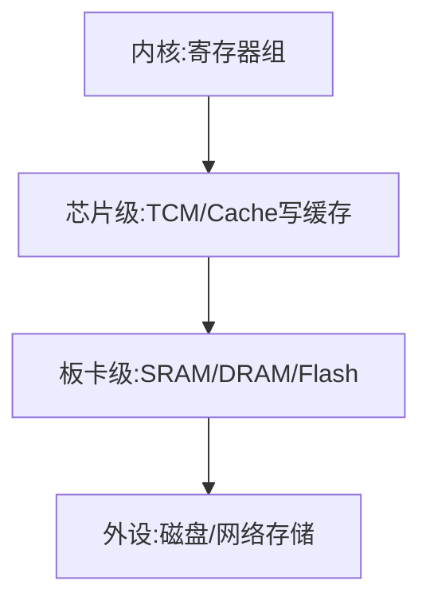

### Cortex-A 系列处理器介绍

#### ARM

ARM 一般有两个含义
ARM 公司，不生产，只进行 CPU 的框架设计
ARM 架构 Cortex-M、Cortex-A、Cortex-R

#### 裸机编程

没有操作系统运行之前的一段代码，可以是汇编也可以是 c 语言实现
bootloader 是一个裸机程序

#### ARM 内核发展

ARM 在 Cortex-A 系列处理器大体上按性能可以排序为：Cortex-A77 处理器、Cortex-A75 处理器、
Cortex-A73 处理器、 Cortex-A57 处理器、 Cortex-A53 处理器、 Cortex-A15 处理器、 Cortex-A9 处理器、 Cortex-A7 处理器、Cortex-A5 处理器等

ARM 产品指令集架构有 ARMv4、ARMv7、ARMv8，ARMv7 之后对 CPU 核心名称进行了调整，改用 Cortex-A,
Cortext-M 和 Cortex-R。
A 系列主要用于操作系统性能较好，M 系列通常用于单片机开发，R 系列主要用于实时控制方面
ARMv8 架构支持了 64bit 的指令集

#### 指令集 CPU 核心、CPU、SoC 区别

指令集通常是指 ARMv7 指令、ARMv8 指令集架构，这部分定义了整体的架构，例如定义了工作模式，中断的处理方法。

CPU 核心是指指令集的具体实现 Cortex-A7 就是根据 ARMv7 指令集来实现的 CPU 核心。

STM32MP157 是意法半导体根据 Cortex-A7 的 CPU 核心设计出来的一款 SoC，SoC 除了 CPU 之外还集成了很多控制器单元，例如 LCD 控制器单元和 UART 控制器单元等。

#### STM32MP157

##### 1.芯片资料

https://www.st.com/zh/microcontrollers-microprocessors/stm32mp157a.html#documentation

2 个 Cortex-A7 核心 MHZ 1 个 Cortex-M4 核心主频 209MHZ

通常需要下载数据手册、参考手册、编程手册、勘误手册

数据手册--介绍硬件特性，软件工程师一般查管脚

参考手册--数据手册的细化，介绍每个寄存器的使用，和软件开发关系密切

编程手册--讲述和芯片相关的体系结构的一些指令

勘误手册--介绍目前该芯片已知的问题，避坑

##### 2.ARM 资料

### Cortex-A7 开发环境

### Cortex-A7 结构

#### 内核工作模式

Cortex-A7 基于 ARMv7-A 架构，共有 9 种工作模式，除用户模式外的其他 8 种处理器模式称为特权模式（Privileged Modes）。在特权模式下，程序可以访问所有的系统资源，也可以任意地进行处理器模式切换

处理器模式可以通过软件控制进行切换，也可以通过外部中断或异常处理过程进行切换

##### 用户模式 usr

正常程序执行模式(非特权)，大部分任务执行在这种模式下

##### 快速中断模式 fiq

当一个高优先级（fast）中断产生时将会进入这种模式，一般用于高速数据传输和通道处理

##### 外部中断模式 irq

当一个低优先级（normal）中断产生时将会进入这种模式，一般用于通常的中断处理

##### 特权模式 svc

当复位或软中断指令执行时进入这种模式，是一种供操作系统使用的保护模式

##### 数据访问中止模式 abt

当存取异常时将会进入这种模式，用于虚拟存储或存储保护

##### 未定义指令中止模式 und

当执行未定义指令时进入这种模式，有时用于通过软件仿真协处理器硬件的工作方式

##### 系统模式 sys

使用和 User 模式相同寄存器集的模式，用于运行特权级操作系统任务

##### 监控模式 mon

可以在安全模式与非安全模式之间进行转换

##### 虚拟化监控模式 hyp

用于虚拟化扩展（可以在一个系统上运行多个操作系统），拥有 PL2 最高级别的权限，工作在正常非安全模式

#### 寄存器组织

Cortex-A7 处理器共有 9 种不同的处理器模式，在每一种处理器模式中都有一组相应的寄存器组


1、在寄存器组织的图中，每个小方块是一个寄存器，每个寄存器都是 32 位的。
2、寄存器没有地址，访问寄存器通过编号进行访问，r0-r15, cpsr, spsr。
3、banked 类型的寄存器属于私有的寄存器，而非 banked 类型的寄存器属于公有的寄存器。
4、user 模式和 system 模式最多可以访问 17 个寄存器， HYP 模式最多可以访问 19 个寄存器，其他的模式可以访问 18 个寄存器。
5、寄存器组织中只有 43 个寄存器，共计 172 字节，因此在开发中尽量不要定义 register 类型的变量，原因就是寄存器个数有限，寄存器类型的变量不可以进行取地址的操作，原因是寄存器没有地址。
6、当前处理器的模式决定着哪组寄存器可操作，任何模式都可以存取下列寄存器。

- 相应的 R0 ～ R12、相应的 R13（Stack Pointer，SP，栈指向）和 R14（the Link Register，LR，链路
  寄存器）。
- 相应的 R15（PC）、相应的 CPSR。特权模式（除 System 模式外）还可以存取相应的 SPSR。只有
  HYP 模式可以存取 ELR_hyp

7、通用寄存器根据其分组与否可分为以下两类：

- 未分组寄存器（Unbanked Register），包括 R0 ～ R7。对应 Low Registers。
- 分组寄存器（Banked Register），包括 R8 ～ R12。对应 High Register。

##### R13（栈指针）寄存器

对应 8 个不同的物理寄存器,一个是 User 模式和 Sys 模式和,而另外 7 个分别用于 7 种异常模式.

R13 寄存器在 ARM 处理器中常用做堆栈指针，称为 SP。这只是一种习惯用法，并没有任何指
令强制性的使用 R13 作为堆栈指针，用户完全可以使用其他寄存器作为堆栈指针。而在 Thumb 指令集
中，有一些指令强制性地将 R13 作为堆栈指针，如堆栈操作指令

在异常处理程序入口处，将用到的其他寄存器的值保存在堆栈中，返回时，重新将这些值加载
到寄存器。通过这种保护程序现场的方法，异常不会破坏被其中断的程序现场。

SP 栈指针寄存器中存放的是栈指针指向的栈空间的地址。此栈是用来压栈保存现场的，特点是先进
后出

##### R14（连接）寄存器

ARM 体系结构中具有下面两种特殊的作用

1.每一种处理器模式用自己的 R14 存放当前子程序的返回地址，当通过 BL 或 BLX 指令调用子程序时，R14 被设置成该子程序的返回地址。在子程序返回时，把 R14 的值复制到程序计数器（PC）

2.当异常中断发生时，该异常模式特定的物理寄存器 R14 被设置成该异常模式的返回地址，对于有些模式 R14 的值可能与返回地址有一个常数的偏移量（如数据异常使用 sub pc，lr，#8 返回）

##### R15（程序计数）寄存器

PC 寄存器中存储的是当前取指指令的地址，当完成取指操作之后，PC 中的值会自动加 4 指向下一条指令

#### 程序状态寄存器

##### CPSR 寄存器

CPSR 寄存器可以在任何处理器模式下被访问,包含内容：

- ALU（Arithmetic Logic Unit，算术逻辑单元）状态标志的备份
- 当前的处理器模式
- 中断使能标志
- 设置处理器的状态

每一种处理器模式下都有一个专用的物理寄存器做备份程序状态寄存器（Saved Program Status Register，SPSR），CPSR 寄存器（和保存它的 SPSR 寄存器）中的位分配如图所示


1.标志位
N（Negative）、Z（Zero）、C（Carry）和 V（oVerflow）通称为条件标志位，这些条件标志位会根据程序中的算术指令或逻辑指令的执行结果进行修改
N 标志位 ———— 设置成当前指令运行结果的 bit[31]的值 当两个由补码表示的有符号整数运算时，N=1 表示运算的结果为负数，N=0 表示结果为正数或零
Z 标志位 ———— Z=1 表示运算的结果为零 Z=0 表示运算的结果不为零。
C 标志位 ———— ① 加法指令中（包括 CMN）当结果产生了进位，则 C=1，表示无符号数运算发生上溢出；其他情况下 C=0 ② 在减法指令中（包括 CMP），当运算中发生错位（即无符号数运算发生下溢出），则 C=0；其他情况下 C=1 ③ 在操作数中包含移位操作的运算指令（非加/减法指令），C 被设置成被移位寄存器最后移出去的位 ④ 其他非加/减法运算指令，C 的值通常不受影响
V 标志位 ———— ① 加/减运算指令，当操作数和运算结果都是以二进制的补码表示的带符号的数时，且运算结果超出了有符号运算的范围是溢出。V=1 表示符号位溢出。② 非加/减法指令，通常不改变标志位 V 的值
Q 标志位 ———— 在带 DSP 指令扩展的 ARM v5 及更高版本中，bit[27]被指定用于指示增强的 DAP 指令是否发生了溢出，因此也就被称为 Q 标志位
J 标志位 ———— 在带 Java 指令支持的 ARM v5 及更高版本中支持。T=0；J=1 表示处于 Jazelle 状态

```txt
T   J   处理器状态
0   1   Jazelle 状态
0   0   ARM 状态
1   0   Thumb 状态
1   1   ThumbEE 状态
```

2.控制位
CPSR 的低 8 位（I、F、T 及 M[4:0]）统称为控制位,当异常发生时，这些位的值将发生相应的变化。另外，如果在特权模式下，也可以通过软件编程来修改这些位的值
中断禁止位 -- I=1，IRQ 被禁止;F=1，FIQ 被禁止;
状态控制位 -- T 位是处理器的状态控制位。T=0 ARM T=1 Thumb
模式控制位 -- M[4:0]作为位模式控制位，这些位的组合确定了处理器处于哪种状态。

```txt
M[4∶0]      处理器模式
0b10000    User 模式
0b10001    FIQ 模式
0b10010    IRQ 模式
0b10011    Supervisor 模式
0b10111    Abort 模式
0b11011    Undefined 模式
0b11111    System 模式
0b10110    Secure monitor 模式
0b11010    Hyp 模式
```

3.IF-THEN 标志位
CPSR 中的 bits[15:10,26:25]称为 if-then 标志位,用于对 thumb 指令集中 if-then-else 这一类语句块的控制

4.E 控制位
大小端控制位：E=1 设置为大端模式，E=0 为小端模式。

5.A 位
A=1 禁止不精确的数据异常

##### SPSR 寄存器

spsr：保存程序状态寄存器 ----> Saved Program Statued Register

> 注意：中断过程中，是由处理器自动将 cpsr 保持到 spsr_irq 的。

### Cortex-A7 内核存储系统和流水线

#### 存储系统

ARM 的存储器系统是由多级构成的，可以分为内核级、芯片级、板卡级、外设级



内核级 -- 典型的 ARM 处理器有多个 32 位寄存器，其访问时间为 ns 量级
芯片级 -- TCM 是一种快速 SDRAM，它紧挨内核，并且保证取指和数据操作的时钟周期数.芯片级的片上 Cache 存储器的容量在 8KB ～ 32KB 之间，访问时间大约为 10ns 级别
板卡级 -- 板卡级的 DRAM。主存储器可能是几 MB 到几十 MB 的动态存储器，访问时间大约为 100ns
外设级 -- 外设级的后援存储器，通常是硬盘，可能从几百 MB 到几十个 GB，访问时间约为几十 ms 级别

处理器核内部的存储管理单元主要包含有：Cache、MMU、Write Buffer（写缓存）等部分，以及可以控制相关存储单元的协处理 CP15


#### 存储管理单元 MMU

在创建多任务嵌入式系统时，最好用一个简单的方式来编写、装载及运行各自独立的任务。目前大多数的嵌入式系统不再使用自己定制的控制系统，而使用操作系统来简化这个过程。较高级的操作系统采用基于硬件的存储管理单元（MMU）来实现上述操作

MMU 提供的一个关键服务是使各个任务作为各自独立的程序在自己的私有存储空间中运行。在带 MMU 的操作系统控制下，运行的任务无须知道其他与之无关的任务的存储需求情况，这就简化了各个任务的设计

MMU 提供了一些资源以允许使用虚拟存储器（将系统物理存储器重新编址，可将其看成一个独立于系统物理存储器的存储空间）。MMU 作为转换器，将程序和数据的虚拟地址（编译时的连接地址）转换成实际的物理地址，即在物理主存中的地址。这个转换过程允许运行的多个程序使用相同的虚拟地址，而各自存储在物理存储器的不同位置;这样存储器就有两种类型的地址：虚拟地址和物理地址。虚拟地址由编译器和连接器在定位程序时分配；物理地址用来访问实际的主存硬件模块

#### 高速缓冲存储器（Cache）、写缓存器（write buffer）

Cache 是一个容量小但存取速度非常快的存储器，它保存最近用到的存储器数据副本。对于程序员来说，Cache 是透明的。

Cache 经常与写缓存器（write buffer）一起使用。写缓存器是一个非常小的先进先出（FIFO）存储器，位于处理器核与主存之间。使用写缓存的目的是，将处理器核和 Cache 从较慢的主存写操作中解脱出来。当 CPU 向主存储器做写入操作时，它先将数据写入到写缓存区中，由于写缓存器的速度很高，这种写入操作的速度也将很高。写缓存区在 CPU 空闲时，以较低的速度将数据写入到主存储器中相应的位置。

#### 流水线的概念与原理

处理器按照一系列步骤来执行每一条指令，典型的步骤如下
1、从存储器读取指令（fetch）
2、译码以鉴别它属于哪一条指令（decode）
3、从指令中提取指令的操作数（这些操作数往往存在于寄存器 reg 中）
4、将操作数进行组合以得到结果或存储器地址（ALU）
5、如果需要，则访问存储器以存储数据（mem）
6、将结果写回到寄存器堆（res）

有一种方法可以明显改善硬件资源的使用率和处理器的吞吐量，这就是在当前一条指令结束之前就开始执行下一条指令，即通常所说的流水线（Pipeline）技术。流水线是 RISC 处理器执行指令时采用的机制。使用流水线，可在取下一条指令的同时译码和执行其他指令，从而加快执行的速度。可以把流水线看做是汽车生产线，每个阶段只完成专门的处理器任务

#### 流水线的分类

##### 3 级流水线

到 ARM7 为止的 ARM 处理器使用简单的 3 级流水线，它包括下列流水线级
1、取指令（fetch）：从寄存器装载一条指令。
2、译码（decode）：识别被执行的指令，并为下一个周期准备数据通路的控制信号。在这一级，指令
占有译码逻辑，不占用数据通路。
3、执行（excute）：处理指令并将结果写回寄存器

##### 5 级流水线

较高性能的 ARM 核使用了 5 级流水线，而且具有分开的指令和数据存储器。把指令的执行分割为 5 部分而不是 3 部分，进而可以使用更高的时钟频率，分开的指令和数据存储器使核的 CPI 明显减少
在 ARM9TDMI 中使用了典型的 5 级流水线，5 级流水线包括下面的流水线级。
1、取指令（fetch）：从存储器中取出指令，并将其放入指令流水线。
2、译码（decode）：指令被译码，从寄存器堆中读取寄存器操作数。在寄存器堆中有 3 个操作数读端口，因此，大多数 ARM 指令能在 1 个周期内读取其操作数。
3、执行（execute）：将其中 1 个操作数移位，并在 ALU 中产生结果。如果指令是 Load 或 Store 指令，则在 ALU 中计算存储器的地址。
4、缓冲/数据（buffer/data）：如果需要则访问数据存储器，否则 ALU 只是简单地缓冲 1 个时钟周期。
5、回写（write-back）：将指令的结果回写到寄存器堆，包括任何从寄存器读出的数据。

##### 8 级流水线

在 Cortex-A7 中有一条 8 级的流水线，从经典 ARM 系列到现在的 Cortex 系列，ARM 处理器的结构在向复杂的阶段发展，但没改变的是 CPU 的取指指令和地址关系，不管是几级流水线，都可以按照最初的 3 级流水线的操作特性来判断其当前的 PC 位置。这样做主要还是为了软件兼容性上的考虑，由此可以判断的是，后面 ARM 所推出的处理核心都满足这一特点

#### 影响流水线性能的因素

- 互锁
  在典型的程序处理过程中，经常会遇到这样的情形，即一条指令的结果被用做下一条指令的操作数，流水线的操作产生中断
- 跳转指令
  跳转指令也会破坏流水线的行为，因为后续指令的取指步骤受到跳转目标计算的影响，因而必须推迟

### ARM 微处理器指令系统

ARM 指令集可以分为跳转指令、数据处理指令、程序状态寄存器传输指令、Load/Store 指令、协处理
器指令和异常中断产生指令。根据使用的指令类型不同，指令的寻址方式分为数据处理指令寻址方式和内
存访问指令寻址方式。

#### ARM 指令的组成

```txt
<opcode> {<c>} {S} <Rd>,<Rn>,<shifter_operand>
<opcode>: 要执行的指令
{<c>}: 为指令执行的条件码。当忽略< c >时，指令为无条件执行。
{S}: 决定指令的操作是否影响 CPSR。在异常返回时，如果操作的目标是 PC 寄存器时，S 标志会同
时将 SPSR 寄存器恢复到 CPSR 中。
<Rd>: 为目标寄存器。
<Rn>: 操作数所在的寄存器。
<shifter_operand>有 11 种形式
```

```txt
指令执行条件
操作码
0000    EQ      Z=1       相等
0001    NE      Z=0       不相等
0010    CS/HS   C=1       无符号数大于等于
0011    CC/LO   C=0       无符号数小于
0100    MI      N=1       负数
0101    PL      N=0       正数或零
0110    VS      V=1       溢出
0111    VC      V=0       没有溢出
1000    HI      C=1且Z=0  无符号数大于
1001    LS      C=0或Z=1  无符号数小于等于
1010    GE      N=V       有符号数大于等于
1011    LT      N!=V      有符号数小于
1100    GT      Z=0且N=V  有符号数大于
1101    LE      Z=1或N!=V 有符号数小于等于
1110    AL      无        无条件执行(默认)
1111    NV      无        从不执行

<shifter_operand>的寻址方式
语法                         寻址方式
#<immediate>                 立即数寻址
<Rm>                         寄存器寻址
<Rm>, LSL #<shift_imm>       立即数逻辑左移
<Rm>, LSL <Rs>               寄存器逻辑左移
<Rm>, LSR #<shift_imm>       立即数逻辑右移
<Rm>, LSR <Rs>               寄存器逻辑右移
<Rm>, ASR #<shift_imm>       立即数算术右移
<Rm>, ASR <Rs>               寄存器算术右移
<Rm>, ROR #<shift_imm>       立即数循环右移
<Rm>, ROR <Rs>               寄存器循环右移
<Rm>, RRX                    寄存器扩展循环右移
```

示例

```asm
MOV R0,#2
ADDS R0,R0,R1
MOV R2,R0
MOV R1, R0, LSL #2
```

#### ARM 处理器寻址方式

##### 数据处理指令寻址方式

- 立即数寻址方式
  指令中的立即数是由一个 8bit 的常数移动 4bit 偶数位（0，2，4，…，26，28，30）得到的，所以，每一条指令都包含一个 8bit 的常数 X 和移位值 Y，得到的立即数 = X 循环右移（2×Y），
  ARM 汇编编译器按照下面的规则来产生立即数的编码：
  当立即数数值在 0~0xFF 范围时，令 X=立即数，Y=0。
  其他情况下，汇编编译器选择使 Y 数值最小的编码方式。
  有效的立即数：
  0xFF：X=0xFF，Y=0
  0x104：X=0x41，Y=15
  0xFF0：X=0xFF，Y=14
  0xF000000F：X=0xFF，Y=2

- 寄存器寻址方式
  寄存器的值可以被直接用于数据操作指令，这种寻址方式是各类处理器经常采用的一种方式，也是一种执行效率较高的寻址方式

- 寄存器移位寻址方式
  和寄存器寻址类似，只是操作前需要对寄存器操作数进行移位操作。寄存器的值在被送到 ALU 之前，可以事先经过桶形移位寄存器的处理。预处理和移位发生在同一周期内，所以有效地使用移位寄存器，可以增加代码的执行效率
  逻辑左移(LSL): 移位后寄存器空出的低位补 0。可以是立即数或寄存器
  逻辑右移(LSR): 移位后寄存器空出的高位补 0
  算术右移(ASR): 移位过程中，符号位保持不变
  循环右移(ROR): 类似 LSR，移位后移除的低位填入空出的高位
  带扩展的循环右移(RRX): 操作数右移一位，移位空出的高位用 C 标志的值填充

```asm
ADD R2, R0, R1, LSR #5 ;将R1的值逻辑右移5位后与R0相加结果传入R2
MOV R1, R0, LSL #2 ;将R0的值逻辑左移2位后将结果传入R1
SUB R1, R2, R0, LSR #4 ;用R2的值减去将R0的值逻辑右移4位后的值将结果传入R1
MOV R2, R4, ROR R0 ;将R4的值循环右移R0次，结果传入R2
```

##### 内存访问指令寻址方式

- 字及无符号字节的 Load/Store 指令的寻址方式

```asm
LDR|STR{<cond>}{B}{T} <Rd>,<addressing_mode>

<addressing_mode>寻址方式  !表示完成数据传输后要更新基址寄存器
格式                                         模式
[Rn，#±<offset_12>]                          立即数偏移寻址
[Rn，±Rm]                                    寄存器偏移寻址
[Rn，Rm，<shift>#< offset_12>]               带移位的寄存器偏移寻址
[Rn，#±< offset_12>]!                        立即数前索引寻址
[Rn，±Rm]!                                   寄存器前索引寻址
[Rn，Rm，<shift>#< offset_12>]!              带移位的寄存器前索引寻址
[Rn]，#±< offset_12>                         立即数后索引寻址
[Rn]，±<Rm>                                  寄存器后索引寻址
[Rn]，±<Rm>，<shift>#< offset_12>            带移位的寄存器后索引寻址
```

- 杂类 Load/Store 指令的寻址方式

```asm
LDR|STR{<cond>}H|SH|SB|D <Rd>, <addressing_mode>
使用该类寻址方式的指令包括（有符号/无符号）半字 Load/Store 指令、有符号字节 Load/Store 指令和双字 Load/Store 指令

<addressing_mode>寻址方式
[Rn，#±<offset_8>]                        立即数偏移寻址
[Rn，±Rm]                                 寄存器偏移寻址
[Rn，#±< offset_8>]!                      立即数前索引寻址
[Rn，±Rm]!                                寄存器前索引寻址
[Rn]，#±< offset_8>                       立即数后索引寻址
[Rn]，±<Rm>                               寄存器后索引寻址
```

- 堆栈操作寻址方式
  堆栈操作寻址方式和批量 Load/Store 指令寻址方式十分类似。但对于堆栈的操作，数据写入内存和从内存中读出要使用不同的寻址模式，因为进栈操作（pop）和出栈操作（push）要在不同的方向上调整堆栈

```asm
LDM|STM {<amode>}{<cond>}<addressing_mode> <Rn>{!},<registers><^>

根据 amode 不同的寻址方式，将堆栈分为以下 4 种
1) 满栈：堆栈指针指向栈顶元素（last used location）
2) 空栈：堆栈指针指向第一个可用元素（the first unused location）
3) 递减栈：堆栈向内存地址减小的方向生长
4) 递增栈：堆栈向内存地址增加的方向生长

根据堆栈的不同种类，将其寻址方式分为以下 4 种
1) 满递减 FD（Full Descending）
2) 空递减 ED（Empty Descending）
3) 满递增 FA（Full Ascending）
4) 空递增 EA（Empty Ascending）

堆栈的寻址方式和批量 Load/Store 指令寻址方式的对应关系
格式                                       模式
[Rn，#±<offset_8>]                         立即数偏移寻址
[Rn，±Rm]                                  寄存器偏移寻址
[Rn，#±< offset_8>]!                       立即数前索引寻址
[Rn，±Rm]!                                 寄存器前索引寻址
[Rn]，#±< offset_8>                        立即数后索引寻址
[Rn]，±<Rm>                                寄存器后索引寻址
```

- 批量 Load/Store 指令的寻址方式
  批量 Load/Store 指令将一片连续内存单元的数据加载到通用寄存器组中或将一组通用寄存器的数据存储到内存单元中,批量 Load/Store 指令的寻址模式产生一个内存单元的地址范围，指令寄存器和内存单元的对应关系满足这样的规则，即编号低的寄存器对应于内存中低地址单元，编号高的寄存器对应于内存中的高地址单元

```asm
LDM|STM {<amode>}{<cond>}<addressing_mode> <Rn>{!},<registers><^>

amode                   模式
IA（Increment After）   后递增方式
IB（Increment Before）  先递增方式
DA（Decrement After）   后递减方式
DB（Decrement Before）  先递减方式
```

- 协处理器 Load/Store 指令的寻址方式

```asm
MCR<c> <coproc>, <opc1>, <Rt>, <CRn>, <CRm>{, <opc2>}
MRC<c> <coproc>, <opc1>, <Rt>, <CRn>, <CRm>{, <opc2>}

<c>：为指令执行的条件码。当忽略< c >时，指令为无条件执行
<coproc>：协处理器名称，范围 p0-p15；
<opc1>：协处理器操作码，范围 0-15；
<Rt>：源寄存器，MCR 指令是将 Rt 寄存器写入协处理器，MRC 指令是将协处理器的内容读取到 Rt 寄存器；
<CRn>：协处理器的目标寄存器；
<CRm>：协处理器中附加的目标寄存器或者源操作寄存器，如果不需要附加信息就设置为 C0，否则结果不可预测；
<opc2>：可选的协处理器特定操作码，当不需要时置 0
```

#### ARM 处理器指令集

##### 数据操作指令

数据操作指令是指对存放在寄存器中的数据进行操作的指令。主要包括数据传送指令、算术指令、逻辑指令、比较与测试指令及乘法指令。如果在数据处理指令前使用 S 前缀，指令的执行结果将会影响 CPSR 中的标志位。数据处理指令如表所示

```txt
MOV 数据传送
MVN 数据取反传送
AND 逻辑与               Rd：=Rn AND op2
EOR 逻辑异或             Rd：=Rn EOR op2
ORR 逻辑或               Rd：=Rn OR op2
BIC 位清 0               Rd：=Rn AND NOT（op2）
SUB 减                   Rd：=Rn − op2
RSB 翻转减               Rd：=op2 − Rn
ADD 加                   Rd：=Rn + op2
ADC 带进位的加            Rd：=Rn + op2 + C
SBC 带进位的减            Rd：=Rn−op2+C−1
RSC 带进位的翻转减        Rd：=op2 − Rn + C − 1
TST 测试                 Rn AND op2 并更新标志位
TEQ 测试相等              Rn EOR op2 并更新标志位
CMP 比较                 Rn−op2 并更新标志位
CMN 负数比较              Rn+op2 并更新标志位
```

- MOV 指令
  MOV 指令是最简单的 ARM 指令，执行的结果就是把一个数 N 送到目标寄存器 Rd，其中 N 可以是寄
  存器，也可以是立即数。MOV 指令多用于设置初始值或者在寄存器间传送数据。
  MOV 指令将移位码（shifter_operand）表示的数据传送到目的寄存器 Rd，并根据操作的结果更新 CPSR
  中相应的条件标志位。

```asm
MOV{<c>}{S} <Rd>,<shifter_operand>

<Rd>：目的寄存器。如果 R15 是目的寄存器，将修改程序计数器或标志。这用于被调用的子函数结束后返回到调用代码，方法是把连接寄存器的内容传送到 R15
<shifter_operand>：要传送到 Rd 寄存器的数据，可以是立即数、寄存器或者通过移位操作得到

eg:
mov r0, r0             ; R0=R0 NOP 指令
mov r0, r0, lsl#3      ; R0=R0*2^3
mov pc, lr             ; 退出到调用者，用于普通函数返回，PC即是R15
movs pc, lr            ; 退出到调用者并恢复标志位，用于异常函数返回

MOV 指令主要完成以下功能:
将数据从一个寄存器传送到另一个寄存器
将一个常数值传送到寄存器中
当PC（R15）用做目的寄存器时，可以实现程序跳转。如MOV PC，LR，所以这种跳转可以实现子程序调用及从子程序返回，代替指令B，BL。
当 PC 作为目标寄存器且指令中 S 位被设置时，指令在执行跳转操作的同时，将当前处理器模式的 SPSR 寄存器的内容复制到 CPSR 中。这种指令MOVS PC LR可以实现从某些异常中断中返回
```

- MVN
  MVN 是反相传送（Move Negative）指令。它将操作数的反码传送到目的寄存器,MVN 指令多用于向寄存器传送一个负数或生成位掩码
  MVN 指令将 shifter_operand 表示的数据的反码传送到目的寄存器 Rd，并根据操作结果更新 CPSR 中相应的条件标志位。

```asm
MVN{<c>}{S} <Rd>,<shifter_operand>

<shifter_operand>：要传送到 Rd 寄存器的数据，可以是立即数、寄存器或者通过移位操作得到。这是逻辑非操作而不是算术操作，这个取反的值加 1 才是它的取负的值。

eg:
mvn r0, #4          ; r0 = -5    4的二进制为00000100,取反11111011,11111011的原码为10000100+1=10000101即-5
mvn r0, #0          ; r0 = -1    0的二进制为00000000,取反11111111,11111111的原码为10000000+1=10000001即-1

MVN 指令主要完成以下功能:
向寄存器中传送一个负数
生成位掩码（Bit Mask）
求一个数的反码
```

- AND 指令

```asm

```

- ORR 指令

```asm

```

- BIC 位清零指令

```asm

```

- EOR 指令

```asm

```

- SUB 指令

```asm

```

- RSB 指令

```asm

```

- SBC 指令

```asm

```

- RSC 指令

```asm

```

- ADD 指令

```asm

```

- ADC 指令

```asm

```

- CMP 指令

```asm

```

- CMN 指令

```asm

```

- TST 测试指令

```asm

```

- TEQ 指令

```asm

```

##### 乘法指令

```txt
MUL        乘（保留 32 位结果）            Rd :=（Rm×Rs）[31:0]
MLA        乘—累加（保留 32 位结果）       Rd :=（Rm×Rs＋Rn）[31:0]
UMULL      无符号数长乘                   RdHi：RdLo := Rm×Rs
UMLAL      无符号长乘—累加                RdHi：RdLo += Rm×Rs
SMULL      有符号数长乘                   RdHi：RdLo := Rm×Rs
SMLAL      有符号数长乘—累加              RdHi：RdLo += Rm×Rs

说明
1) RdHi：RdLo是由 RdHi（最高有效 32 位）和 RdLo（最低有效 32 位）连接形成的 64 位数，[31:0]只选取结果的最低有效 32 位。
2) 简单的赋值由:=表示。
3) 累加（将右边加到左边）是由+=表示。
4) 各个乘法指令中的位 S（参考下文具体指令的语法格式）控制条件码的设置会产生以下结果
  - 对于产生 32 位结果的指令形式，将标志位 N 设置为 Rd 的第 31 位的值；对于产生长结果的指令形式，将其设置为 RdHi 的第 31 位的值
  - 对于产生 32 位结果的指令形式，如果 Rd 等于零，则标志位 Z 置位；对于产生长结果的指令形式，RdHi 和 RdLo 同时为零时，标志位 Z 置位
  - 将标志位 C 设置成无意义的值
  - 标志位 V 不变
```

- MUL 指令

```asm

```

- MLA 指令

```asm

```

- UMULL 指令

```asm

```

- UMLAL 指令

```asm

```

- SMULL 指令

```asm

```

- SMLAL 指令

```asm

```

##### Load/Store 指令

Load/Store 内存访问指令在 ARM 寄存器和存储器之间传送数据。ARM 指令中有 3 种基本的数据传送指令

1. 单寄存器 Load/Store 指令

```txt
助记符            操作                                         行为
LDR              把存储器中的一个字装入一个寄存器                Rd←mem32[address]
STR              将寄存器中的字保存到存储器                      Rd→mem32[address]
LDRB             把一个字节装入一个寄存器                       Rd←mem8[address]
STRB             将寄存器中的低 8 位字节保存到存储器             Rd→mem8[address]
LDRH             把一个半字装入一个寄存器                        Rd←mem16[address]
STRH             将寄存器中的低 16 位半字保存到存储器             Rd→mem16[address]
LDRBT            用户模式下将一个字节装入寄存器                   Rd←mem8[address] under user mode
STRBT            用户模式下将寄存器中的低 8 位字节保存到存储器     Rd→mem8[address] under user mode
LDRT             用户模式下把一个字装入一个寄存器                 Rd←mem32[address]under user mode
STRT             用户模式下将存储器中的字保存到寄存器             Rd←mem32[address] under user mode
LDRSB            把一个有符号字节装入一个寄存器                  Rd←sign{mem8[address]}
LDRSH            把一个有符号半字装入一个寄存器                  Rd←sign{mem16[address]}
```

2. 多寄存器 Load/Store 内存访问指令

3. 单寄存器交换指令

### ARM 汇编语言程序设计

### Cortex-A7 GPIO

### Cortex-A7 UART
