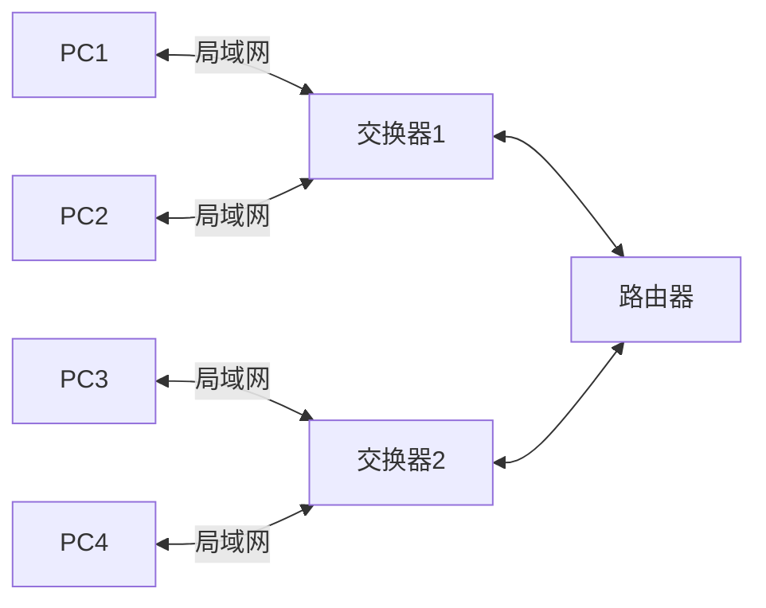

## 网络编程

### 基础知识

IPV4 地址：网络号+主机号

- A 类 8 位（0**\_\_\_\_**） + 24 位
  0.0.0.0 - 127.255.255.255
- B 类 16 位（10**\_\_\_**） + 16 位
  128.0.0.0 - 191.255.255.255
- C 类 24 位（110**\_\_**） + 8 位
  192.0.0.0 - 223.255.255.255
- D 类 （1110**\_**）多播地址
  224.0.0.0 - 239.255.255.255
- E 类 （1111**\_**）保留
  240.0.0.0 - 255.255.225.255

子网/子网掩码
三级 IP 地址 网络号+（子网号+主机号）
例子：192.168.1.0 分配四个部分 40 台机子  -- 0.0.0.255 & ip
原始子网掩码 11111111.11111111.11111111.00000000
分配后子网掩码 11111111.11111111.11111111.11000000
  第一个子网可用地址 192.168.1.1-62
  第二个子网可用地址 192.168.1.64-126
  第三个子网可用地址 192.168.1.129-190
  第四个子网可用地址 192.168.1.193-254
### TCP

### UDP

### UDP 聊天室服务器

### FTP 文件传输服务器
