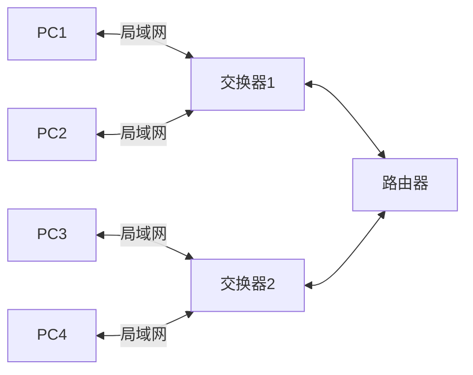

## 网络编程

### 基础知识



IPV4 地址：网络号+主机号

- A 类 8 位（0**\_\_\_\_**） + 24 位
  0.0.0.0 - 127.255.255.255
- B 类 16 位（10**\_\_\_**） + 16 位
  128.0.0.0 - 191.255.255.255
- C 类 24 位（110**\_\_**） + 8 位
  192.0.0.0 - 223.255.255.255
- D 类 （1110**\_**）多播地址
  224.0.0.0 - 239.255.255.255
- E 类 （1111**\_**）保留
  240.0.0.0 - 255.255.225.255

子网/子网掩码
三级 IP 地址 网络号+（子网号+主机号）
例子：192.168.1.0 分配四个部分 40 台机子 -- 0.0.0.255 & ip
原始子网掩码 11111111.11111111.11111111.00000000
分配后子网掩码 11111111.11111111.11111111.11000000
第一个子网可用地址 192.168.1.1-62
第二个子网可用地址 192.168.1.64-126
第三个子网可用地址 192.168.1.129-190
第四个子网可用地址 192.168.1.193-254

OSI 模型

通信子网(物理 数据 网络)

- 物理层 物理传输信号 接口 信号形式
- 数据链路层 数据组成可发送、接受的帧
- 网络层 数据分层 路由选择

面向通信(传输)

- 传输层 差错处理、恢复；流量控制；提供可靠的数据传输

面向服务(会话 表示)

- 会话层 建立通信进程的逻辑名字与物理名字之间的联系
- 表示层 数据格式定义，数据转换、加密

面向应用(ftp e-mail telnet)

- 应用层

tcp/ip 协议族

- 应用层 http dns smtp
- 传输层 tcp udp
- 网络层 ip icmp igmp
- 网络接口与物理层 网卡驱动物理接口

#### socket

编程接口，一种特殊的文件描述符，不仅限于 TCP/IP 协议，面向连接，无连接

类型

- 流式套接字 SOCK_STREAM

- 数据报套接字 SOCK_DGRAM

- 原始套接字 SOCK_RAW
  对较低层次协议 IP、ICMP 等直接访问

#### 端口号

区分一台主机接收到的数据包应该转给哪个任务来处理，使用端口号区分
TCP 和 UDP 端口号独立
1-1023 端口通常系统占用
已登记端口 1024~49151
动态或私有端口 49152~65535

#### 字节序

不同类型 CPU 主机内存存储多字节整数序列有两种方法，小端序和大端序
小端序 低序字节存储在低地址
大端序 高序字节存储在低地址
网络传输中按网络字节序 大端序

### TCP

可靠的面向连接的协议，全双工面向连接的可靠的按序递交无重复的字节流通信

#### tcp 通信流程

- 客户端
  创建套接字 socket
  请求连接 connect
  发送数据 send wrire
  读取数据 recv read
  关闭套接字 close
- 服务端
  创建套接字 socket
  绑定套接字 bind
  启动监听 listen 监听 将 socket 返回的文件描述符属性主动变被动
  接受客户端连接请求 accept 阻塞等待客户端的链接请求，如有链接返回一个用于通信的套接字
  创建新的连接套接字
  读取数据 recv read
  处理
  发送数据 send write
  关闭套接字 close 连接的 通信的都要关闭

```c
#include <sys/types.h>          /* See NOTES */
#include <sys/socket.h>
/// domain协议族  AF_UNIX AF_LOCAL    AF_INET AF_INET6
/// type  SOCK_STREAM SOCK_DGRAM SOCK_RAW
/// protocol 0 系统默认自动帮助匹配对应协议
/// 成功返回文件描述符 失败-1
int socket(int domain, int type, int protocol);
/// sockfd 文件描述符
/// addr sockaddr结构体 填充的时候填的是sockaddr_in
#if 0
struct sockaddr {
    sa_family_t sa_family; //u short int 2字节
    char        sa_data[14];
}
struct sockaddr_in {
    sa_family_t s     sin_family; //u short int 2字节
    uint16_t          sin_port; //16位tcp/udp端口号 2字节
    struct in_addr    sin_addr; //32位IP地址 4字节
    char              sin_zero[8]; //不使用 8字节
}
#endif
/// addrlen 结构体大小
int bind(int sockfd, const struct sockaddr *addr,
                socklen_t addrlen);
// htonl()作用是转换为网络字节序的long类型。(host to net)
// htons(8088)作用是将端口号由主机字节序转换为网络字节序的short类型。(host to net)
// inet_addr("192.168.1.88")作用是将一个IP字符串转化为一个网络字节序的整数值，用于sockaddr_in.sin_addr.s_addr
// inet_ntoa()作用是将一个sin_addr结构体输出成IP字符串(network to ascii)

/// sockfd 文件描述符
/// backlog 客户端同时连接服务器的最大个数（连接队列）
/// 成功0 失败-1
int listen(int sockfd, int backlog);

/// addr 不关心哪个客户端则 NULL
/// addrlen 不关心哪个客户端则 NULL
/// 返回文件描述符 失败-1
int accept(int sockfd, struct sockaddr *addr, socklen_t *addrlen);

/// sockfd accept返回的文件描述符
/// buf 存放位置
/// len 大小
/// flags 一般填0 阻塞
/// 成功返回接收的字节数 失败-1 TCP没有数据返回0 end-of-file返回0 udp每个domain最后返回0
ssize_t recv(int sockfd, void *buf, size_t len, int flags);
```

### UDP

不可靠的无连接的协议，全双工无连接不保证可靠的数据报通信

### UDP 聊天室服务器

### FTP 文件传输服务器
