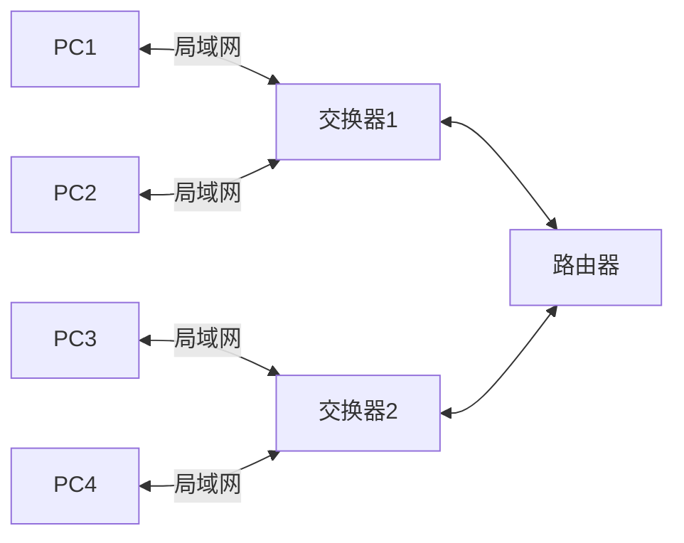

## 网络编程

### 基础知识



IPV4 地址：网络号+主机号

- A 类 8 位（0**\_\_\_\_**） + 24 位
  0.0.0.0 - 127.255.255.255
- B 类 16 位（10**\_\_\_**） + 16 位
  128.0.0.0 - 191.255.255.255
- C 类 24 位（110**\_\_**） + 8 位
  192.0.0.0 - 223.255.255.255
- D 类 （1110**\_**）多播地址
  224.0.0.0 - 239.255.255.255
- E 类 （1111**\_**）保留
  240.0.0.0 - 255.255.225.255

子网/子网掩码
三级 IP 地址 网络号+（子网号+主机号）
例子：192.168.1.0 分配四个部分 40 台机子 -- 0.0.0.255 & ip
原始子网掩码 11111111.11111111.11111111.00000000
分配后子网掩码 11111111.11111111.11111111.11000000
第一个子网可用地址 192.168.1.1-62
第二个子网可用地址 192.168.1.64-126
第三个子网可用地址 192.168.1.129-190
第四个子网可用地址 192.168.1.193-254

OSI 模型

通信子网(物理 数据 网络)

- 物理层 物理传输信号 接口 信号形式
- 数据链路层 数据组成可发送、接受的帧
- 网络层 数据分层 路由选择

面向通信(传输)

- 传输层 差错处理、恢复；流量控制；提供可靠的数据传输

面向服务(会话 表示)

- 会话层 建立通信进程的逻辑名字与物理名字之间的联系
- 表示层 数据格式定义，数据转换、加密

面向应用(ftp e-mail telnet)

- 应用层

tcp/ip 协议族

- 应用层 http dns smtp
- 传输层 tcp udp
- 网络层 ip icmp igmp
- 网络接口与物理层 网卡驱动物理接口

#### socket

编程接口，一种特殊的文件描述符，不仅限于 TCP/IP 协议，面向连接，无连接

类型

- 流式套接字 SOCK_STREAM

- 数据报套接字 SOCK_DGRAM

- 原始套接字 SOCK_RAW
  对较低层次协议 IP、ICMP 等直接访问

#### 端口号

区分一台主机接收到的数据包应该转给哪个任务来处理，使用端口号区分
TCP 和 UDP 端口号独立
1-1023 端口通常系统占用
已登记端口 1024~49151
动态或私有端口 49152~65535

#### 字节序

不同类型 CPU 主机内存存储多字节整数序列有两种方法，小端序和大端序
小端序 低序字节存储在低地址
大端序 高序字节存储在低地址
网络传输中按网络字节序 大端序

### TCP

可靠的面向连接的协议，全双工面向连接的可靠的按序递交无重复的字节流通信

#### tcp 通信流程

- 客户端
  创建套接字 socket
  请求连接 connect
  发送数据 send wrire
  读取数据 recv read
  关闭套接字 close
- 服务端
  创建套接字 socket
  绑定套接字 bind
  启动监听 listen 监听 将 socket 返回的文件描述符属性主动变被动
  接受客户端连接请求 accept 阻塞等待客户端的链接请求，如有链接返回一个用于通信的套接字
  创建新的连接套接字
  读取数据 recv read
  处理
  发送数据 send write
  关闭套接字 close 连接的 通信的都要关闭

```c
#include <sys/types.h>          /* See NOTES */
#include <sys/socket.h>
/// domain协议族  AF_UNIX AF_LOCAL    AF_INET AF_INET6
/// type  SOCK_STREAM SOCK_DGRAM SOCK_RAW
/// protocol 0 系统默认自动帮助匹配对应协议
/// 成功返回文件描述符 失败-1
int socket(int domain, int type, int protocol);
/// sockfd 文件描述符
/// addr sockaddr结构体 填充的时候填的是sockaddr_in
#if 0
struct sockaddr {
    sa_family_t sa_family; //u short int 2字节
    char        sa_data[14];
}
struct sockaddr_in {
    sa_family_t s     sin_family; //u short int 2字节
    uint16_t          sin_port; //16位tcp/udp端口号 2字节
    struct in_addr    sin_addr; //32位IP地址 4字节
    char              sin_zero[8]; //不使用 8字节
}
#endif
/// addrlen 结构体大小
int bind(int sockfd, const struct sockaddr *addr,
                socklen_t addrlen);
// htonl()作用是转换为网络字节序的long类型。(host to net)
// htons(8088)作用是将端口号由主机字节序转换为网络字节序的short类型。(host to net)
// inet_addr("192.168.1.88")作用是将一个IP字符串转化为一个网络字节序的整数值，用于sockaddr_in.sin_addr.s_addr
// inet_ntoa()作用是将一个sin_addr结构体输出成IP字符串(network to ascii)

/// sockfd 文件描述符
/// backlog 客户端同时连接服务器的最大个数（连接队列）
/// 成功0 失败-1
int listen(int sockfd, int backlog);

/// addr 不关心哪个客户端则 NULL
/// addrlen 不关心哪个客户端则 NULL
/// 返回文件描述符 失败-1
int accept(int sockfd, struct sockaddr *addr, socklen_t *addrlen);

/// sockfd accept返回的文件描述符
/// buf 存放位置
/// len 大小
/// flags 一般填0 阻塞 MSG_DONTWAIT 非阻塞
/// 成功返回接收的字节数 失败<0 断开0
ssize_t recv(int sockfd, void *buf, size_t len, int flags);

ssize_t send(int sockfd, const void *buf, size_t len, int flags);

int connect(int sockfd, const struct sockaddr *addr,
                   socklen_t addrlen);
```

### UDP

不可靠的无连接的协议，全双工无连接不保证可靠的数据通报

```c
/// 接收数据通报
ssize_t recvfrom(int sockfd, void *buf, size_t len, int flags,
                        struct sockaddr *src_addr, socklen_t *addrlen);
/// 发送数据通报
ssize_t sendto(int sockfd, const void *buf, size_t len, int flags,
                      const struct sockaddr *dest_addr, socklen_t addrlen);
```

> UDP 中使用了 connect 后可以使用 send 和 recv,connect 实际是指定了连接地址和端口

### UDP 聊天室服务器

### FTP 文件传输服务器

需要实现的 ftp 服务器和客户端的功能
1.list 列出服务器文件列表
2.put 向服务器上传文件
3.get 从服务器下载文件
4.quit 退出客户端

- 客户端伪代码

```txt
1.socket
2.填充结构体
3.connect
4.while 1
  echo list、put file、get file、quit
  fgets(buf,sizeof(buf),stdin);
  switch(){
    case 'l':
      client_list(sockfd);
      break;
    case 'p':
      client_put(sockfd);
      break;
    case 'g':
      client_get(sockfd);
      break;
    case 'q':
      client_quit(sockfd);
      break;
    default:
      ...
  }
  struct{
    type: int
    data: char[16]
  }
  client_list(int sockfd){
    type: 'l'
    send(sockfd,buf,sizeof(buf),0);
    recv(sockfd,buf,sizeof(buf),0);
    printf();
  }
  client_put(int sockfd){
    type: 'p' data: 'filename'
    send(sockfd,buf,sizeof(buf),0);
    open()
    read()
    write(buf)
    send()
    close()
  }
  client_get(int sockfd){}
  client_quit(int sockfd){}
```

- 服务端伪代码

```txt
1.socket
2.bind
3.listen
4.accept
5.while(1){
  switch(){
    case 'l':
      serv_list(acceptfd);
      break;
    case 'p':
      serv_put(acceptfd,filename,size);
      break;
    case 'g':
      serv_get(acceptfd);
      break;
    case 'q':
      serv_quit(acceptfd);
      break;
    default:
      ...
  }
}
serv_list(int acceptfd){
  opendir()
  readdir()
  send(acceptfd,buf,sizeof(buf),0);
}
serv_put(int acceptfd,char* filename,int size){
  int fd = open(filename);
  recv();
  write(fd);
  //判断文件是否写完
}
serv_get(int acceptfd){}
serv_quit(int acceptfd){}
```

### IO 模型

4 种 IO 模型

#### 阻塞 IO ————最常用、最简单、效率最低

读操作的 read、recv、recvfrom
写操作的 write、send
其他操作 accept、connect

#### 非阻塞 IO ————可防止系统阻塞在 I/O 操作上,需要轮询

应用程序不停地 polling 内核来检查 I/O 操作是否就绪，极其浪费 CPU 资源

```c
#include <unistd.h>
#include <fcntl.h>
int fcntl(int fd, int cmd, ... /* arg */ );
// arg表示可变参数，由cmd决定
// cmd
// 1、复制文件描述符(F_DUPFD、F_DUPFD_CLOEXEC)；
// 2、获取/设置文件描述符标志(F_GETFD、F_SETFD)；
// 3、获取/设置文件状态标志(F_GETFL、F_SETFL)；
// 4、获取/设置记录锁(F_GETLK、F_SETLK、F_SETLKW)；

// fcntl设置一个套接字的标识为O_NONBLOCK来实现非阻塞
int flag = fcntl(sockfd, F_GETFL);
flag |= O_NONBLOCK;
fcntl(sockfd, F_SETFL, flag);
```

#### IO 多路复用 ————允许同时对多个 IO 进行控制

1.先构建一张有关文件描述符的表

2.将你关心的文件描述符加入到这个表中

3.调用一个函数 select / poll

4.当这些文件描述符中的一个或多个已经准备好进行 IO 操作的时候，该函数才返回(阻塞)

5.判断是哪一个或哪些文件描述符产生了事件

6.做对应的逻辑处理

##### select

缺点

1.一个进程最多只能监听 1024 个文件描述符 和系统设置的一个进程打开最大文件描述符个数相关

2.是一种轮询机制

3.涉及到用户态和内核态的数据拷贝

> select 函数返回之后会自动将除了产生事件的文件描述符以外的位全部清除

```c
#include <sys/select.h>
/// 将set集合中的fd清除掉
void FD_CLR(int fd, fd_set *set);
/// 判断是否在集合中
int  FD_ISSET(int fd, fd_set *set);
/// 加入集合
void FD_SET(int fd, fd_set *set);
/// 清空集合
void FD_ZERO(fd_set *set);
/// nfds 最大文件描述符个数
/// readfds 读事件集合
/// writefds 写事件集合 //NULL表示不关心
/// exceptfds 异常事件集合
/// timeout 超时检测 设置了timeout非阻塞 超时没有事件直接返回
// struct timeval {
//     time_t      tv_sec;         /* seconds */
//     suseconds_t tv_usec;        /* microseconds */
// };
/// timeout NULL 返回值<0出错 >0有事件产生 可能有一个或多个 FD_ISSET(fd_set)来判断是否产生了事件
/// timeout 设置了值 返回值<0出错 >0有事件产生 =0 超时时间到没有事件产生
int select(int nfds, fd_set *readfds, fd_set *writefds,
          fd_set *exceptfds, struct timeval *timeout);
```

##### poll

优化了文件描述符个数的限制，poll 是一种轮询机制，涉及到用户态和内核态的数据拷贝

1.创建结构体数组 struct pollfd fds[N]

2.将关心的文件描述符加入到结构体成员中

```c
fds[0].fd = 0;
fds[0].events = POLLIN;
fds[1].fd = mouse1;
fds[1].events = POLLIN;
```

3.调用 poll 函数，如果返回表示有事件产生

4.判断具体是哪个文件描述符产生了事件

```c
#include <poll.h>
/// fds 关心的文件描述符数组
/// nfds 个数
/// timeout 超时检测 毫秒级的 1000~1s  -1~阻塞
// struct pollfd {
//     int   fd;         /* file descriptor */文件描述符
//     short events;     /* requested events */关心的事件，读
//     short revents;    /* returned events */返回的事件
// };
/// 返回值 成功返回非负值pollfd中revents已设置为非0值的元素个数 0超时 -1出错
int poll(struct pollfd *fds, nfds_t nfds, int timeout);

```

##### epoll

没有文件描述符的限制，上限：系统可以最大打开的文件数目 1G 内存 10w 左右
每个 fd 上面有 callback 函数，只有活跃的 fd 才主动调动 callback 函数————不是轮询机制
不涉及用户态和内核态的拷贝

```c
#include <sys/epoll.h>
/// 创建红黑树根节点
/// 成功返回epoll文件描述符 失败返回-1 使用完epoll后调用close
int epoll_create(int size);
/// 控制epoll属性 成功返回0 失败返回-1
/// epfd epoll_create返回的句柄
/// op 动作类型
///     EPOLL_CTL_ADD 添加
///     EPOLL_CTL_MOD 修改已注册fd的监听事件
///     EPOLL_CTL_DEL 从epfd删除一个fd
/// fd 需要监听的fd
/// event 对应文件描述符的事件监听配置对象
// typedef union epoll_data {
//     void        *ptr;
//     int          fd;
//     uint32_t     u32;
//     uint64_t     u64;
// } epoll_data_t;
// struct epoll_event {
//     uint32_t     events;      /* Epoll events */
//     epoll_data_t data;        /* User data variable */
// };
int epoll_ctl(int epfd, int op, int fd, struct epoll_event *event);
/// 等待事件到来 成功返回发生事件的文件描述符数，失败返回-1
/// epfd 句柄
/// events 从内核得到的事件的集合
/// maxevents 每次能处理事件的最大个数
/// timeout  超时检测 -1阻塞 毫秒
int epoll_wait(int epfd, struct epoll_event *events,int maxevents, int timeout);
```

#### 信号驱动 IO

### 实现并发服务器

多进程方式实现 fork

多线程方式实现 pthread

IO 多路复用实现 三种 select poll epoll

服务器模型

- 循环服务器 同一时刻只能响应一个客户端的请求

- 并发服务器 同一时刻能响应多个客户端的请求

## TCP/IP 网络编程进阶

### 常见协议头分析

TCP/IP 网络封包格式

```text
以太网头     ip头    tcp头
EthernetH   IPH     TCPH  APPH Userdata Ethernettrailer
14          [20~24    20                  ]  4
            46~1500

TCP Flag
C 0x80 CWR Congestion Window Reduced
E 0x40 ECN Echo ECE
U 0x20 Urgent
A 0x10 Ack
P 0x08 Push
R 0x04 Reset
S 0x02 Syn
F 0x01 Fin

UDP头仅有源端口 目标端口 长度 校验码 8字节
```

wireshark 抓包

### 网络信息检索和套接字属性设置

```c
// gethostname() 获取主机名
// getpeername() 获得与套接口相连的远程协议地址
// getsockname() 获得本地套接口协议地址
// gethostbyname() 根据主机名取得主机信息
// gethostbyaddr() 根据主机地址取得主机信息
// getprotobyname() 根据协议名取得主机协议信息
// getprotobynumber() 根据协议号取得主机协议信息
// getservbyname() 根据服务名取得相关服务信息
// getservbyport() 根据端口号取得相关服务信息
// getsockopt() 获取一个套接口选项
// setsockopt() 设置一个套接口选项
// ioctl()/fcntl() 设置套接口的工作方式
#include <sys/types.h>          /* See NOTES */
#include <sys/socket.h>
/// sockfd 套接字
/// level 层次 SOL_SOCKET应用层 IPPROTO_IP网络层 IPPRO_TCP传输层
/// optname 操作名称
/// optval
/// optlen 长度
int setsockopt(int sockfd, int level, int optname,
                      const void *optval, socklen_t optlen);


/* 允许重复使用本地地址与套接字进行绑定 */
// int i = 1;
// setsockopt(sockfd, SOL_SOCKET, SO_REUSEADDR, &i, sizeof(i));
```

### 网络超时检测（alarm）

```c
// select、poll设置超时时间

// SOL_SOCKET SO_RCVTIMEO 接收超时
// struct timeval tv = {1,0};
// setsockopt(sockfd,SOL_SOCKET,SO_RCVTIMEO,&tv,sizeof(tv));
int setsockopt(int sockfd, int level, int optname,
                      const void *optval, socklen_t optlen);

/// seconds之后内核进程向当前进程发送SIGALRM信号
/// alarm产生SIGALRM信号后会打断下一个系统调用
unsigned int alarm(unsigned int seconds);
// struct sigaction {
//     void     (*sa_handler)(int);
//     void     (*sa_sigaction)(int, siginfo_t *, void *);
//     sigset_t   sa_mask;
//     int        sa_flags;
//     void     (*sa_restorer)(void);
// };
int sigaction(int signum, const struct sigaction *act,
              struct sigaction *oldact);

struct sigaction act;
//获取属性
sigaction(SIGALRM,NULL,&act);
//修改
// act.sa_handler = handler
//写回
sigaction(SIGALRM,&act,NULL);

```

### 广播和组播

同时发给局域网中的所有主机称为广播，只有用户数据报（UDP 协议）套接字才能广播

广播地址 192.168.1.0 网段为例，最大主机地址 192.168.1.255 代表该网段广播地址
发送到这个地址的数据包被所有的主机接收，255.255.255.255 在所有网段中都代表广播地址

广播的发送者

```c
// 1创建用户套接字
int sockfd = socket(AF_NET,SOCK_DGRAM,0);
// 2缺省创建的套接字不允许广播数据包，需要设置属性
int i = 1;
setsockopt(sockfd,SOL_SOCKET,SO_BROADCAST,&i,sizeof(i));
// 3接收方地址指定为广播地址 指定端口信息
struct sockaddr_in addr;
bzero(&addr, sizeof(addr));
addr.sin_family = AF_INET;
addr.sin_port = htons(atoi(8888));
addr.sin_addr.s_addr = inet_addr("192.168.1.255");
// 4发送数据包
char buf[128] = {0};
spritf(buf,"%s","hello");
sendto(sockfd, buf, sizeof(buf), 0, (struct sockaddr *)&addr, sizeof(addr));
```

广播的接收者

```c
// 1创建用户套接字
int sockfd = socket(AF_NET,SOCK_DGRAM,0);
// 2绑定IP地址（广播地址或0.0.0.0） 端口 必须与发送方指定的端口相同
struct sockaddr_in addr;
bzero(&addr, sizeof(addr));
addr.sin_family = AF_INET;
addr.sin_port = htons(atoi(8888));
addr.sin_addr.s_addr = inet_addr("192.168.1.255");
int len = sizeof(addr);
bind(sockfd, (struct sockaddr *)&addr, sizeof(addr))
// 3接收数据包
char buf[128] = {0};
recvfrom(sockfd, buf, sizeof(buf), 0, (struct sockaddr *)&addr, &len);
```

### UNIX 域套接字
